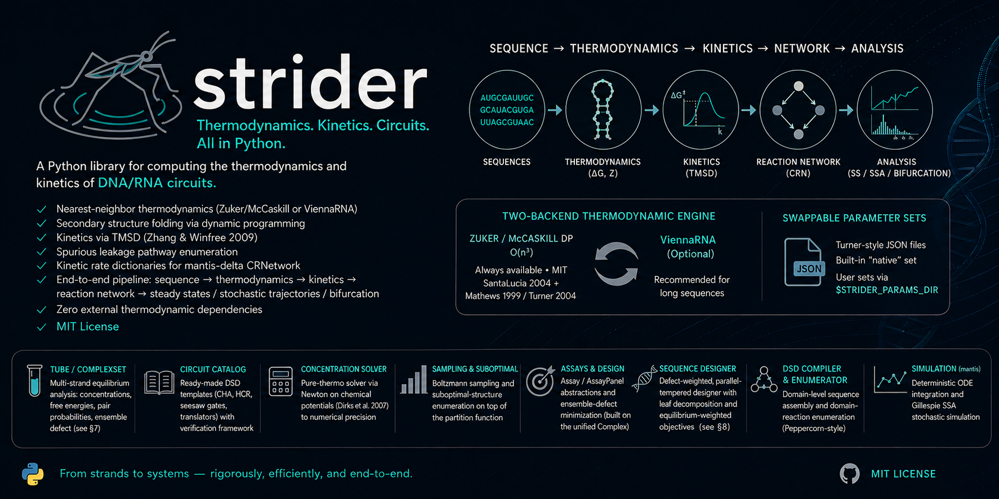

<!-- Placeholder logo — replace docs/assets/logo.svg with final artwork (a transparent PNG/SVG both work). -->
<p align="center">
  
</p>

<h1 align="center">strider-dna</h1>
<p align="center"><em>Nucleic Acid Thermodynamics, Kinetics, and Circuit Design</em></p>

<p align="center">
<a href="#running-the-tests"></a>
<a href="#installation"></a>
<a href="#license"></a>
</p>

<!-- Original badges, superseded by the centered block above:
[](#running-the-tests)
[](#installation)
[](#license)
-->

**strider** is a Python library for computing the thermodynamics and kinetics of DNA/RNA circuits. Given a set of strand sequences, it predicts free energies via nearest-neighbor parameters, folds secondary structures via dynamic programming, derives TMSD rate constants from the Zhang & Winfree (2009) empirical model, enumerates spurious leakage pathways, and produces kinetic rate dictionaries that drop directly into a mantis-delta `CRNetwork`. The full pipeline — sequence → thermodynamics → kinetics → reaction network → steady states / stochastic trajectories / bifurcation — runs end-to-end with **zero external thermodynamic dependencies** under an MIT license.

strider ships a two-backend thermodynamic engine that automatically selects the best available calculator: its own Zuker / McCaskill O(n³) DP (always available, MIT, sourced from SantaLucia 2004 + Mathews 1999 / Turner 2004 primary tables) or the ViennaRNA C library (optional, recommended for long sequences). The same API surface works with both — only `ThermoEngine(backend=…)` changes. Nearest-neighbor parameters live in a swappable `ParameterSet` that loads from Turner-style JSON files (built-in "native" set always available; user-supplied JSON discoverable via `$STRIDER_PARAMS_DIR`).

Beyond thermodynamics, strider provides a **`Tube` / `ComplexSet` API** for multi-strand equilibrium analysis (concentrations, free energies, lazy pair-probability matrices, ensemble defect — see [§7](#7-multi-strand-tube-analysis)), a **circuit catalog** of ready-made DSD templates (CHA, HCR, seesaw gates, translators) wrapped around a generic verification framework, a **pure-thermo concentration solver** matching standard Newton-on-chemical-potentials (Dirks et al. 2007) to numerical precision, **Boltzmann sampling** and **suboptimal-structure enumeration** on top of the partition function, an **`Assay` / `AssayPanel`** design abstraction for ensemble-defect minimization (built on top of the unified `Complex` primitive) plus a **defect-weighted, parallel-tempered sequence designer** with leaf decomposition and equilibrium-weighted objectives (see [§8](#8-sequence-design-and-the-assay-abstraction)), a lightweight **`DSDCompiler`** for domain-level sequence assembly plus a **`DomainReactionEnumerator`** that *derives* a circuit's reaction network from strand topology (Peppercorn-style: bind / branch-migration / open → detailed-balance rates → CRN), and — via the companion **mantis** library — Gillespie SSA stochastic simulation in addition to deterministic ODE integration.

---

## Table of contents

1. [Installation](#installation)
2. [Core concepts](#core-concepts)
3. [Quick start](#quick-start)
4. [Command-line interface](#command-line-interface)
5. [User guide](#user-guide)
   - [ThermoEngine and backends](#1-thermoengine-and-backends)
   - [DNA / RNA thermodynamics](#2-dna--rna-thermodynamics)
   - [Secondary structure prediction](#3-secondary-structure-prediction)
   - [Boltzmann sampling and subopt enumeration](#4-boltzmann-sampling-and-subopt-enumeration)
   - [TMSD kinetics](#5-tmsd-kinetics)
   - [Leakage enumeration](#6-leakage-enumeration)
   - [Multi-strand tube analysis](#7-multi-strand-tube-analysis)
   - [Sequence design and the Assay abstraction](#8-sequence-design-and-the-assay-abstraction)
   - [Mutation sensitivity analysis](#9-mutation-sensitivity-analysis)
   - [Off-target screening](#10-off-target-screening)
   - [Circuit catalog and the mantis bridge](#11-circuit-catalog-and-the-mantis-bridge)
   - [DSDCompiler — domain-level circuit assembly](#12-dsdcompiler--domain-level-circuit-assembly)
   - [Stochastic simulation via mantis](#13-stochastic-simulation-via-mantis)
   - [Parameter sweeps and caching](#14-parameter-sweeps-and-caching)
   - [Parameter sets and custom NN tables](#15-parameter-sets-and-custom-nn-tables)
   - [Differentiable thermodynamics (PyTorch)](#16-differentiable-thermodynamics-pytorch)
   - [Export formats](#17-export-formats)
   - [Surface transducer, LOD, and surface ΔG](#18-surface-transducer-lod-and-surface-δg)
   - [G-quadruplex / aptamer folding](#19-g-quadruplex--aptamer-folding)
   - [Low-copy stochastic capture — shot-noise-limited LOD](#20-low-copy-stochastic-capture--shot-noise-limited-lod)
6. [API reference](#api-reference)
7. [Examples](#examples)
8. [Backend comparison](#backend-comparison)
9. [Running the tests](#running-the-tests)
10. [Troubleshooting](#troubleshooting)
11. [Background and theory](#background-and-theory)
12. [Citation](#citation)
13. [License](#license)

---

## Installation

```bash
# Core library (native thermodynamic backend always included)
pip install strider-dna

# From source
git clone https://github.com/EmilioVenegas/strider
cd strider
pip install -e .
```

**Optional backends:**

```bash
pip install strider-dna[vienna]   # ViennaRNA backend (recommended for long sequences)
pip install strider-dna[mantis]   # mantis-delta integration (circuit templates, CRNetwork)
pip install strider-dna[pandas]   # SweepResult.to_dataframe()
pip install strider-dna[parallel] # ProcessPoolExecutor sweeps
pip install strider-dna[full]     # all of the above
```

**Requirements:** Python ≥ 3.10, NumPy ≥ 1.24, SciPy ≥ 1.10, Matplotlib ≥ 3.6.

> **Note on import name:** the PyPI distribution is `strider-dna`, but the Python package is imported as `strider`:
> ```python
> import strider
> from strider import ThermoEngine, CHA, HCR, SeesawGate, Translator
> from strider import Strand, Complex, SetSpec, ComplexSet, Tube, TubeResult, tube_analysis
> from strider import Assay, AssayPanel, Assembly, DSDCompiler
> from strider import ParameterSet, load_parameters
> from strider import (
>     SequenceDesigner, DesignObjective, HardConstraint,
>     DefectWeightedPolicy, per_residue_defect_from_ensemble, decompose_assays,
> )
> from strider import solve_equilibrium, sample_structures, subopt_structures
> ```

### Receipts

Concrete benchmark numbers, reproducible with `python scripts/bench_accuracy.py`:

| Cohort | Source | strider native |
|---|---|---|
| 11 canonical hairpins (Cheong 1990, Heus 1991, Antao 1991, Mathews 1999, SantaLucia 2004, Lu 2006) | published dot-brackets | mean **F-measure 0.99**, **10/11 exact match** |
| `toehold_kf`, 0–12 nt | Zhang & Winfree 2009 Fig. 4 | **0 % relative error** |
| MFE wall-clock | — | 20 nt ≈ 1.6 ms, 50 nt ≈ 35 ms, 100 nt ≈ 590 ms (single-thread pure Python) |

The mean-F threshold is CI-enforced by `tests/test_benchmarks.py`, so accuracy regressions show up as a red test rather than as a missed claim.

---

## Core concepts

### Nearest-neighbor (NN) model

The standard model for DNA and RNA duplex thermodynamics. The free energy of a fully paired duplex is computed by summing stacking contributions from every adjacent dinucleotide pair (the "nearest neighbors") and adding initiation terms for the terminal bases. Parameters come from SantaLucia & Hicks (2004) for DNA and Mathews et al. (1999) for RNA. strider also includes Sugimoto et al. (1995) parameters for DNA:RNA hybrids.

### Ensemble free energy and ΔΔG

`ThermoEngine.pfunc(seq)` returns the **ensemble free energy** ΔG = −RT ln Q, where Q is the partition function summed over all secondary structures weighted by their Boltzmann factors. This is more informative than the minimum free energy (MFE) alone because it accounts for the full structural ensemble.

The **reaction free energy** ΔΔG = ΣG(products) − ΣG(reactants) measures how thermodynamically driven a strand displacement reaction is. Negative ΔΔG means the reaction is spontaneous (products are lower energy).

### Toehold-mediated strand displacement (TMSD)

A mechanism in which a short single-stranded overhang (the *toehold*) on a target strand initiates hybridization with an incoming strand, which then branch-migrates to displace the incumbent strand. Catalytic Hairpin Assembly (CHA) is built from a cascade of TMSD reactions. The forward rate constant kf depends sensitively on toehold length; Zhang & Winfree (2009) measured kf empirically for 0–12 nt toeholds in DNA.

### Kinetic stability and the sweet spot

Hairpin kinetics for CHA have a "sweet spot": stems stable enough to suppress leakage (ΔG ≲ −6 kcal/mol) but not so stable that the toehold is buried (ΔG ≳ −12 kcal/mol). The `CHA` circuit template's `verify()` method checks this and several other design criteria via the generic `CheckRegistry` framework — easy to extend with custom checks for non-CHA topologies (`HCR`, `SeesawGate`, etc.).

---

## Quick start

```python
from strider import ThermoEngine, CHA, solve_equilibrium

# Create a thermodynamic engine (auto-selects best available backend)
engine = ThermoEngine(material='dna', celsius=37, sodium=0.137, magnesium=0.01)

# Fold a hairpin
result = engine.mfe('TCAACATCAGTCTGATAAGGAGGGAGGTTATCAGACTGA')
print(result.structure)   # '((((((......(((((((((((.)))))))))))....))))))'
print(result.energy)      # -7.8  kcal/mol

# Duplex binding free energy
ddg = engine.ddg(
    reactants=['TCAACATCAGTCTGATGTTGA', 'TCAACATCAGTCTGATAAGG'],
    products=[['TCAACATCAGTCTGATGTTGA', 'TCAACATCAGTCTGATAAGG']],
)
print(f"ΔΔG = {ddg:.2f} kcal/mol")  # ΔΔG = -8.3 kcal/mol

# Equilibrium concentrations of a 2-strand mix
res = solve_equilibrium(
    complexes={
        'A':  (['A'], 0.0),
        'B':  (['B'], 0.0),
        'AB': (['A', 'B'], -10.0),
    },
    totals={'A': 1e-7, 'B': 1e-7},
    celsius=37.0,
)
print(f"[AB] = {res.concentrations['AB']:.2e} M")  # ~4.0e-8

# Full CHA biosensor verification + mantis export
cha = CHA(
    sequences={
        'mirna': 'TAGCTTATCAGACTGATGTTGA',
        'H1':    'TCAACATCAGTCTGATAAGGAGGGAGGTTATCAGACTGA',
        'H2':    'TCAGTCTGATAAGGAGGGAGGTATCAGACTGATGTTGATTTTT',
        'CP':    'AAAAA',
    },
    engine=engine,
)
print(cha.verify())                  # pretty-printed CircuitReport
rn = cha.to_crnetwork()              # requires mantis-delta
sim = cha.simulate(                  # deterministic ODE
    {'mirna': 10e-9, 'H1': 100e-9, 'H2': 100e-9, 'CP': 100e-9}, (0, 7200),
)
```

Beyond CHA: replace `CHA(...)` with `HCR(...)`, `SeesawGate(logic='AND', ...)`, `Translator(...)`, or roll your own subclass of `CircuitTemplate`. Every template has the same `.verify()`, `.to_crnetwork()`, `.simulate()`, `.steady_states()` surface.

---

## Command-line interface

Installing strider registers a `strider` console script. Every subcommand takes `--json` for machine-readable output, and any sequence argument accepts `-` for stdin or `@path` for a file.

```bash
# MFE structure
$ strider fold GCGCAAAAGCGC
GCGCAAAAGCGC
((((....))))
ΔG = -2.350 kcal/mol  (4 bp)

# Ensemble ΔG (single- or multi-strand)
$ strider pfunc GCGCAAAAGCGC
ΔG_ens = -3.127 kcal/mol  (Z = 159.7, backend=native)

$ strider pfunc GCGCATGC GCATGCGC --backend vienna

# Duplex ΔG and melting temperature
$ strider duplex GCGCATGC                     # auto-uses reverse complement
$ strider duplex GCGCATGC GCATGCGC --sodium 0.05

# Tm only
$ strider melt GCGCATGCATGC --strand-conc 1e-7

# Co-transcriptional folding trajectory
$ strider cotx GGGAAACCCAAAGGG --min-length 5 --material rna
   5  .....              ΔG=+0.000
   ...
  15  (((...)))(((...))) ΔG=-2.240

# CHA / circuit verification from a JSON sequence spec
$ strider verify cha_spec.json
```

All commands accept `--celsius`, `--material {dna,rna}`, `--sodium`, `--magnesium`, and `--backend` where relevant. Run `strider <cmd> --help` for full options.

---

## User guide

### 1. ThermoEngine and backends

`ThermoEngine` is the central dispatcher. Instantiate once and pass it through your analysis.

```python
from strider import ThermoEngine

# Default is the native engine — strider's own, dependency-free, authoritative.
# 'auto' resolves to 'native' (it is never silently replaced by an external lib).
engine = ThermoEngine(material='dna', celsius=37, sodium=0.137, magnesium=0.01)

# Explicit backend
engine_0 = ThermoEngine(backend='native')    # default; always available, MIT-licensed
engine_v = ThermoEngine(backend='vienna')    # OPTIONAL cross-check only; must be requested

# Check what's available
print(ThermoEngine.available_backends())    # e.g. ['native'] or ['native', 'vienna']
print(engine.backend_name)                  # 'native' (unless you asked for 'vienna')

# Optional: load a specific nearest-neighbor parameter set
engine_p = ThermoEngine(material='dna', parameter_set='native-dna')
print(engine_p.params)                       # ParameterSet(name='native-dna', material='DNA', ...)
```

#### Persistent caching

Every `mfe()` and `pfunc()` call can be memoized to a SQLite database. Results are keyed by a SHA-256 hash of (operation, material, temperature, salt, sequences):

```python
from strider import ThermoEngine, DiskCache

cache = DiskCache('~/.strider/my_project.db', max_size_mb=200, ttl_days=30)
engine = ThermoEngine(material='dna', celsius=37, cache=cache)

# First call computes; subsequent calls for the same inputs are instant
result = engine.mfe('ATCGATCG')
print(cache.stats())  # {'hits': 1, 'misses': 0, 'hit_rate': 1.0, 'entries': 1, ...}
```

#### ML correction hook

`correction_model` accepts any callable `(sequence: str) → float` that returns a ΔΔG correction (kcal/mol). This is added to every `pfunc()` result — useful for plugging in an empirically calibrated neural-network correction on top of the NN model:

```python
my_model = lambda seq: -0.02 * seq.count('G')   # trivial example
engine = ThermoEngine(correction_model=my_model)
```

---

### 2. DNA / RNA thermodynamics

#### Duplex ΔG

```python
from strider import ThermoEngine, duplex_dg, melting_temperature

# Via engine (uses backend-appropriate method)
engine = ThermoEngine()
dg = engine.duplex_dg('ATCGATCG', 'CGATCGAT')
print(f"ΔG = {dg:.2f} kcal/mol")       # ΔG = -7.4 kcal/mol

# Standalone NN function (DNA only, always native)
dg_nn = duplex_dg('ATCGATCG', celsius=37.0, sodium_M=0.137)
print(f"ΔG (NN) = {dg_nn:.2f} kcal/mol")

# Melting temperature
tm = melting_temperature('ATCGATCG', strand_conc_M=250e-9, sodium_M=0.137)
print(f"Tm = {tm:.1f} °C")             # Tm = 26.3 °C
```

#### Hairpin intramolecular folding

```python
# Single sequence → pfunc gives ensemble ΔG of all intramolecular structures
result = engine.pfunc('GGGAAACCC')
print(f"Ensemble ΔG = {result.free_energy:.2f} kcal/mol")
print(f"Partition function Q = {result.partition_function:.3e}")
print(f"Pair probability matrix shape: {result.pair_probs.shape}")   # (9, 9)
```

#### Reaction ΔΔG

`engine.ddg()` is the workhorse for pathway analysis. Each element of `reactants` / `products` is either a single sequence string (computed as a monomer) or a list of sequences (computed as a multi-strand complex):

```python
mirna = 'TAGCTTATCAGACTGATGTTGA'
H1    = 'TCAACATCAGTCTGATAAGGAGGGAGGTTATCAGACTGA'

# ΔΔG for miRNA + H1 → miRNA·H1 complex
ddg_r1 = engine.ddg(
    reactants=[mirna, H1],
    products=[[mirna, H1]],   # list inside list = multi-strand complex
)
print(f"ΔΔG(R1) = {ddg_r1:.2f} kcal/mol")  # e.g. -8.5 kcal/mol
```

#### Toehold accessibility

The fraction of the ensemble in which all toehold positions are simultaneously unpaired — a direct measure of how accessible the toehold is for incoming strand binding:

```python
# Check accessibility of the first 6 nt (the toehold) of H1
prob = engine.toehold_accessibility(H1, toehold_positions=list(range(6)))
print(f"Toehold accessible in {prob:.1%} of ensemble")
```

#### Salt corrections

Salt corrections for non-1M NaCl and Mg²⁺ are applied automatically when `sodium ≠ 1.0` or `magnesium > 0`. Two distinct corrections are wired in:

- **Duplex / melting temperature** — Owczarzy et al. (2004) for Na⁺ and Owczarzy et al. (2008) for Mg²⁺, with a mixed-ion regime from the √[Mg²⁺]/[Na⁺] ratio.
- **Partition function / ensemble ΔG** — per-base-pair correction ``ΔG_per_bp = −0.114·ln([Na⁺] + 3.4·√[Mg²⁺])`` kcal/mol, applied to each closed pair inside the McCaskill DP so it is automatically ensemble-weighted by the pair probability. This is an Owczarzy-style empirical fit (Owczarzy 2004/2008) over Na⁺ ∈ [0.05, 1.0] M, Mg²⁺ ∈ [0, 0.1] M at ±0.005 kcal/mol/bp; see `strider.thermo.salt.dg_per_bp_salt`.

The two formulas serve different purposes (Tm uses the original Owczarzy Tm-shift form; pfunc needs a per-pair ΔG that integrates over the structural ensemble). Both reduce to zero at 1 M Na⁺ / 0 Mg²⁺, the SantaLucia/Turner reference state.

#### Chemical modifications (LNA, 2′OMe, PS)

```python
from strider import ModificationSite, apply_modifications

dg_unmod = engine.duplex_dg('ATCGATCG')

mods = [
    ModificationSite(position=0, mod_type='LNA'),   # +L at position 0
    ModificationSite(position=7, mod_type='LNA'),   # +L at position 7
]
dg_mod = apply_modifications(dg_unmod, 'ATCGATCG', mods)
print(f"ΔΔG(modification) = {dg_mod - dg_unmod:.2f} kcal/mol")  # ~-3.0
```

---

### 3. Secondary structure prediction

#### MFE structure

```python
from strider import fold_mfe, ThermoEngine

# Standalone Zuker-style DP (native backend)
structure, energy, pairs = fold_mfe('GGGAAATTTCCC', celsius=37.0, material='dna')
print(structure)    # '((((....))))'
print(energy)       # -2.8 kcal/mol
print(pairs)        # [(0, 11), (1, 10), (2, 9), (3, 8)]

# Via engine (uses configured backend)
engine = ThermoEngine()
result = engine.mfe('GGGAAATTTCCC')
print(result.structure, result.energy, result.base_pairs)
```

#### Pseudoknots

`fold_pseudoknot()` extends the standard MFE algorithm to consider H-type pseudoknots (the most common class in biosensor contexts). It uses a restricted Rivas & Eddy (1999) grammar at O(n⁴) time:

```python
from strider import fold_pseudoknot

structure, energy, pairs = fold_pseudoknot('GGGCCCTTTGGGCCC')
# structure uses () for normal pairs, [] for pseudoknot pairs
print(structure)    # e.g. '(((....[[)))....]]]'
```

#### Co-transcriptional folding

`fold_cotranscriptional()` sweeps prefix lengths and folds each one, returning the trajectory of structures the strand passes through while being transcribed. This matters for riboswitches, aptamers, and any RNA whose biology depends on a kinetic intermediate rather than the final MFE:

```python
from strider import fold_cotranscriptional

traj = fold_cotranscriptional('GGGAAACCCAAAGGG', material='rna', min_length=5)
for p in traj.prefixes:
    print(f'{p.length:>3}  {p.structure}  ΔG={p.energy:+.2f}')

# Detect where existing pairs broke as 3' sequence arrived
print(traj.rearrangements())   # e.g. [(9, 12)] — refold between length 9 and 12
print(traj.final().structure)  # fully-transcribed MFE
```

`step=N` subsamples every Nth prefix for long sequences. The full-length prefix is always included regardless of step.

#### Dot-bracket parsing and analysis

```python
from strider import parse_pairs, to_dot_bracket, validate
from strider.structure.dot_bracket import stem_regions, unpaired_positions

structure = '(((...)))'
pairs = parse_pairs(structure)          # [(0, 8), (1, 7), (2, 6)]
rebuilt = to_dot_bracket(pairs, 9)     # '(((...)))'
print(validate('(((...)))'))           # True
print(validate('(((...))'))            # False (mismatched)

stems = stem_regions(structure)        # [(0, 8, 3)] — one stem of length 3
unpaired = unpaired_positions(structure)  # [3, 4, 5]
```

#### Mountain representation

The mountain plot encodes the nesting depth at each position — a compact fingerprint for comparing structures:

```python
from strider import mountain_vector, compare_structures

m = mountain_vector('(((...)))')      # array([0, 1, 2, 2, 2, 2, 2, 1, 0])
dist = compare_structures('(((...)))', '((.......))')  # L1 distance, range [0, 1]
print(f"Structure distance: {dist:.3f}")
```

---

### 4. Boltzmann sampling and subopt enumeration

When the MFE structure alone misrepresents the ensemble (e.g. competing folds within a few kcal/mol of the optimum), two routines on top of the partition function help inspect what's really happening.

#### Boltzmann sampling

Draw `n` structures distributed according to their equilibrium probabilities (Ding & Lawrence 2003, stochastic traceback over the Qb/Q/QM matrices):

```python
from strider import sample_structures
from collections import Counter

samples = sample_structures('GCGCGCAAAAGCGCGC', n_samples=100, seed=0)
counts = Counter(db for db, _ in samples)
for db, n in counts.most_common(5):
    print(f"{n:3d}  {db}")
# 78  ((((((....))))))      ← MFE dominates for a strong hairpin
#  9  ............
#  5  (((((......))))).
#  ...
```

#### Suboptimal-structure enumeration

Enumerate *all* structures within `gap` kcal/mol of the MFE (Wuchty-style worklist over the V/W matrices, energy-pruned):

```python
from strider import subopt_structures

for db, e, _ in subopt_structures('GCGCAAAAGCGC', gap=3.0, max_structures=20):
    print(f"{e:7.3f}  {db}")
# -2.350  ((((....))))
# -0.110  .(((....))).
# -0.010  (((......)))
#  0.000  ............
```

Both procedures are also exposed as engine methods (`engine.sample(seq, n)` and `engine.subopt(seq, gap)`) for use inside design objectives.

---

### 5. TMSD kinetics

#### Toehold rate constants

`toehold_kf()` uses the Zhang & Winfree (2009) empirical lookup table at 25 °C and applies an Arrhenius correction to the target temperature (Ea ≈ 20 kcal/mol for DNA TMSD):

```python
from strider import toehold_kf, displacement_kf, leakage_kf, rates_from_ddg

# Forward rate at 37 °C for a 6-nt toehold
kf = toehold_kf(n_nt=6, material='dna', celsius=37.0)
print(f"kf = {kf:.2e} M⁻¹ s⁻¹")      # kf ≈ 5.5e5 M⁻¹ s⁻¹

# Derive reverse rate from ΔΔG and detailed balance
kf_val, kr_val = rates_from_ddg(ddg=-8.5, kf=kf, celsius=37.0)
print(f"kr = {kr_val:.2e} s⁻¹")

# Boltzmann-suppressed leakage rate (hairpin breathing model)
k_leak = leakage_kf(stem_stability_kcal=7.5)
print(f"k_leak = {k_leak:.2e} M⁻¹ s⁻¹")   # ≪ kf
```

#### TMSDKineticModel — full circuit rates

`TMSDKineticModel` computes ΔΔG internally from the `ThermoEngine` and returns mantis-compatible rate dictionaries:

```python
from strider import ThermoEngine, TMSDKineticModel

engine = ThermoEngine(material='dna', celsius=37, sodium=0.137, magnesium=0.01)
model = TMSDKineticModel(engine)

# Compute rates for a single reaction
rate_set = model.reaction_rates(
    reactant_seqs=['TAGCTTATCAGACTGATGTTGA', 'TCAACATCAGTCTGATAAGG'],
    product_seqs=[['TAGCTTATCAGACTGATGTTGA', 'TCAACATCAGTCTGATAAGG']],
    toehold_length=6,
    mechanism='toehold_binding',
)
print(rate_set)
# TMSDRateSet(kf=5.5e5, kr=2.1e-3, k_eq=2.6e8, ddg=-8.5, toehold_length=6, ...)

# Build a full mantis-compatible rate dict for a circuit
reactions = [
    "mirna + H1 <-> mirna_H1",
    "mirna_H1 + H2 <-> H1H2 + mirna",
]
sequences = {
    'mirna': 'TAGCTTATCAGACTGATGTTGA',
    'H1':    'TCAACATCAGTCTGATAAGG...',
    'H2':    'TCAGTCTGATAAGGA...',
}
rates = model.circuit_rates(reactions, sequences, toehold_map={"mirna + H1 <-> mirna_H1": 6})
```

#### Arrhenius utilities

```python
from strider import arrhenius, detailed_balance_kr, k_eq_from_ddg, ddg_from_k_eq

# Scale a rate constant between temperatures
kf_50 = arrhenius(k_ref=5.5e5, ea_kcal=20.0, T_ref_K=298.15, T_K=323.15)

# Derive reverse rate from ΔΔG
kr = detailed_balance_kr(kf=5.5e5, ddg_kcal=-8.5, celsius=37.0)

# Convert between ΔΔG and Keq
keq = k_eq_from_ddg(-8.5, celsius=37.0)   # ≈ 9.6e5
ddg = ddg_from_k_eq(keq, celsius=37.0)    # ≈ -8.5
```

---

### 6. Leakage enumeration

`LeakageEnumerator` systematically checks all pairwise (and optional tripartite) strand combinations for thermodynamically favorable spurious complexes:

```python
from strider import ThermoEngine, LeakageEnumerator

engine = ThermoEngine()
enumerator = LeakageEnumerator(
    engine,
    ddg_threshold=-4.0,      # report reactions with ΔΔG < -4 kcal/mol
    max_complex_size=3,       # check pairs and triplets
    max_pathways=100,
)

strands = {
    'H1': 'TCAACATCAGTCTGATAAGG...',
    'H2': 'TCAGTCTGATAAGGAG...',
    'CP': 'AAAAA',
}

report = enumerator.enumerate(
    strands,
    intended_reactions=["H1 + H2 <-> H1H2"],  # exclude known-intended reactions
)

print(report)
# LeakageReport(3 spurious reactions, worst ΔΔG=-5.82 kcal/mol)

for rxn in report.reactions:
    print(rxn.mantis_string, f"  ΔΔG={rxn.ddg:.2f}")

# Filter to only the worst offenders
critical = report.filter(ddg_threshold=-5.0)

# Export as mantis reaction strings
mantis_strings = report.to_mantis_strings()
```

Each `SpuriousReaction` has a `pathway_type` classifying it as `"hybridization"`, `"displacement"`, or `"cooperative"`.

---

### 7. Multi-strand tube analysis

The high-level `Tube` API answers the question "given these strands at these total concentrations, what does the equilibrium ensemble look like?" The pipeline:

1. Wrap each sequence in a `Strand(name, sequence, material)`.
2. Describe which complexes can form via a `ComplexSet` with a `SetSpec` (max stoichiometry plus optional include/exclude rules).
3. Build a `Tube(strand_totals, complexes)`.
4. Call `tube.analyze(engine)` (or `tube_analysis([tube1, tube2, ...], engine)`).
5. Inspect `TubeResult.concentrations`, `.free_energies`, `.strand_free`, plus lazy `.pair_probabilities(name)` and `.defect(name, target_structure)`.

```python
from strider import Strand, ComplexSet, SetSpec, Tube, ThermoEngine

H1 = Strand("H1", "GCAGTGAGACGAGCTGCT", material="dna")
H2 = Strand("H2", "AGCAGCTCGTCTCACTGC", material="dna")

engine = ThermoEngine(material="dna", celsius=37, sodium=0.137, magnesium=0.01)

tube = Tube(
    strand_totals={H1: 1e-6, H2: 1e-6},
    complexes=ComplexSet([H1, H2], SetSpec(max_size=2)),  # monomers + all dimers
    name="biosensor",
)
result = tube.analyze(engine)

for species, conc in sorted(result.concentrations.items(),
                             key=lambda kv: -kv[1]):
    print(f"{species:6s}  ΔG = {result.free_energies[species]:+7.2f}  [X] = {conc:.2e} M")

# Lazy: pair-probability matrix and ensemble defect only computed on demand.
P = result.pair_probabilities("H1_H2")
d = result.defect("H1", "((((....))))")
```

`SetSpec` controls enumeration:

```python
SetSpec(max_size=2)                                   # all complexes ≤ 2 strands
SetSpec(max_size=3)                                   # plus trimers
SetSpec(max_size=2, exclude=[Complex.from_names(["H1", "H1"])])  # drop homodimer
SetSpec(max_size=0, include=[                          # only explicit complexes
    Complex.from_names(["H1", "H2"], name="signal"),
])
```

`Complex` is canonicalized by sorted strand names, so `Complex(strands=(H1, H2))` and `Complex(strands=(H2, H1))` are the same chemical species. The cyclic-rotation symmetry number σ (Dirks et al. 2007 eq. 11) is exposed at `cx.sigma` and applied automatically inside the engine's pfunc.

#### Low-level solver

`solve_equilibrium()` is the underlying convex-dual Newton solver if you want to skip the Tube wrapper (e.g. you already have per-complex ΔG values from somewhere else):

```python
from strider import solve_equilibrium

res = solve_equilibrium(
    complexes={
        "A":  (["A"],      0.0),
        "B":  (["B"],      0.0),
        "AB": (["A", "B"], -10.0),     # ΔG of the dimer (kcal/mol, 1 M standard)
    },
    totals={"A": 1e-7, "B": 1e-7},
    celsius=37.0,
)
print(res.converged, res.iterations, res.residual)
print(res.concentrations)              # {'A': 6.0e-8, 'B': 6.0e-8, 'AB': 4.0e-8}
```

If your input ΔG comes from a tool using a non-1 M reference state (e.g. water-molarity at ~55 M), pass `standard_state_M=water_molarity(celsius)` so the solver applies the corresponding (N − 1)·RT·ln(c₀) shift per N-strand complex.

The legacy `equilibrium_from_engine(engine, strands_dict, totals, max_size=N)` is preserved as a thin wrapper over `Tube.analyze` — keep it for backward compat, prefer the `Tube` API for new code.

#### Rotational symmetry

`cyclic_symmetry(strand_list)` returns the cyclic-symmetry number σ used to correct homomeric multi-strand pfunc values. `ThermoEngine.pfunc` and `Complex.sigma` already use it under the hood so that every backend reports species-level (not ordered-complex) ΔG.

---

### 8. Sequence design and the Assay abstraction

`SequenceDesigner` minimizes a composable `DesignObjective` using simulated annealing. Free domains are optimized; fixed domains (e.g. the miRNA binding site) are held constant.

```python
from strider import ThermoEngine, SequenceDesigner, DomainSpec, DesignObjective, HardConstraint

engine = ThermoEngine()

# Specify domains: free vs fixed
domains = {
    'toehold':  DomainSpec(length=6, material='dna'),                 # free
    'stem':     DomainSpec(length=11, material='dna'),                # free
    'binding':  DomainSpec(sequence='TAGCTTATCAGACTGATGTTGA'),        # fixed
}

# Compose objective: target ΔΔG for binding + hairpin stability
objective = (
    DesignObjective.ddg_target(engine, ['binding'], [['binding', 'stem']], target=-9.0, weight=2.0)
    + DesignObjective.gc_content('toehold', target_gc=0.5, weight=1.0)
    + DesignObjective.minimize_leakage(engine, ['toehold', 'stem'], threshold=-4.0, weight=0.5)
)

# Hard constraints: no AAAA runs, GC content between 40–60%
constraints = [
    HardConstraint.max_run(max_run_length=4),
    HardConstraint.gc_content(min_gc=0.4, max_gc=0.6),
]

designer = SequenceDesigner(engine, seed=42)
result = designer.design(
    domains,
    objective,
    hard_constraints=constraints,
    n_trials=10,
    max_iterations=500,
)

print(result)
# DesignResult(score=0.0312, iterations=500, seqs=['toehold', 'stem', 'binding'])
print(result.sequences)
print(result.objective_breakdown)
```

#### Built-in objectives

| Factory method | What it penalizes |
|---|---|
| `DesignObjective.ddg_target(engine, reactants, products, target)` | (ΔΔG − target)² |
| `DesignObjective.ddg_range(engine, reactants, products, min, max)` | ΔΔG outside [min, max] |
| `DesignObjective.minimize_leakage(engine, strand_names, threshold)` | Pairwise ΔΔG below threshold |
| `DesignObjective.toehold_accessible(engine, strand_name, positions, min_prob)` | Low toehold accessibility |
| `DesignObjective.ensemble_defect(engine, strand_names, target_structure)` | Normalized expected mispaired nucleotides vs target dot-bracket (Zadeh 2011) — NUPACK `complex_design` |
| `DesignObjective.multitube_defect(engine, tubes, tube_weights=None)` | Weighted sum of the **test-tube ensemble defect** (structural + concentration defect) over N tubes — NUPACK `tube_design` (1 tube) / multistate design (N tubes); see below |
| `DesignObjective.gc_content(strand_name, target_gc)` | (GC − target)² |
| `DesignObjective.from_callable(fn)` | Any Python callable returning a float |

**Multistate / multi-tube design (`multitube_defect`).** This is the equilibrium-aware analogue of `ensemble_defect`, matching NUPACK's `tube_design` and multistate test-tube design. Each *tube* is given as `(tube_factory, on_targets)`, where `tube_factory(seqs) → Tube` rebuilds the tube from the current sequences and `on_targets` is a list of `(complex_canonical_name, target_dot_bracket, target_concentration_M)`. For every tube the optimizer runs a real equilibrium solve and scores the normalized [test-tube ensemble defect](https://docs.nupack.org) `TubeResult.tube_ensemble_defect`:

```
C_tube = ( Σ_h c_h·ñ(h, s_h)  +  Σ_h |h|·max(0, c_h* − c_h) ) / ( Σ_h |h|·c_h* )
          └── structural defect ──┘   └── concentration defect ──┘
```

The **structural** term is each on-target complex's equilibrium concentration `c_h` times its *unnormalized* ensemble defect; the **concentration** term penalizes on-target material that failed to form at its target concentration `c_h*` because the strands were sequestered in off-targets. Off-targets need no explicit list or ΔΔG threshold — they are simply every non-on-target complex in the tube, and the equilibrium solve has already distributed strands among them. The multi-tube objective is `Σ_t tube_weights[t]·C_tube(t)`, so a single tube reproduces `tube_design` and several tubes give true multistate design. A tube whose solve raises contributes `+inf` (the SA move is rejected).

**Dynamical (closed-loop) objectives.**  These factories drive optimization
from a *kinetic* cost: each evaluation rebuilds a mantis `CRNetwork` via the
caller-supplied `network_factory: (seqs) → CRNetwork` (typically a closure
over `CircuitBridge.to_crnetwork` or a circuit template's `.to_crnetwork`)
and runs an ODE simulation or bifurcation scan before returning a scalar.
They compose with the static objectives under the same `+` / `*` protocol.

| Factory method | What it penalizes |
|---|---|
| `DesignObjective.kinetic_trajectory(factory, ic, target_curve, times)` | Normalized MSE between simulated and target concentration trajectories |
| `DesignObjective.maximize_kcat(factory, species, ic, t_window)` | `−Δ[species]/Δt` (drives the catalytic production rate up) |
| `DesignObjective.minimize_leak(factory, signal, ic_no_trigger, t_window, threshold)` | `(log10(leak / threshold))²` for a no-trigger control sim above threshold |
| `DesignObjective.bistable_threshold(factory, parameter, range, species, target)` | `(log10(threshold_actual / target))²` at the bifurcation-scan crossing |
| `DesignObjective.from_simulation(factory, ic, t_span, cost_fn)` | Escape hatch — arbitrary `cost_fn(SimulationResult) → float` |

See `examples/09_dynamical_design.py` for a complete pipeline; the spec
behind these factories is item 1 of `outperform_nupack.md` (closed-loop
dynamical sequence design).

Objectives compose with `+` and scale with `*`:

```python
total = 2.0 * objective_a + objective_b + 0.5 * objective_c
```

#### Built-in hard constraints

| Factory method | What it enforces |
|---|---|
| `HardConstraint.no_repeats(motifs)` | Forbid specified sequence motifs |
| `HardConstraint.gc_content(min_gc, max_gc)` | GC fraction in [min, max] |
| `HardConstraint.no_self_complement(min_length)` | No self-complementary run ≥ min_length |
| `HardConstraint.iupac_pattern(strand_name, pattern, start)` | IUPAC code match at offset |
| `HardConstraint.max_run(max_run_length)` | No homopolymer run > max_run_length |
| `HardConstraint.min_length(length)` | Minimum sequence length |
| `HardConstraint.from_callable(fn)` | Any `(name, seq) → bool` |

#### Assay / AssayPanel — high-level design intent

For circuit-level design, `Assay` bundles a set of on-target assemblies (each with its dot-bracket target and expected concentration) plus off-target assemblies that must *not* form. It compiles into a `DesignObjective` that the designer minimizes:

```python
from strider import Assay, AssayPanel, Assembly, SequenceDesigner, DomainSpec

assay = Assay(
    name='hairpin_sensor',
    on_targets=[
        Assembly('H', ['H'], '((((....))))', concentration=1e-7),
    ],
    off_targets=[
        Assembly('H_H', ['H', 'H']),       # forbid homodimer
    ],
    off_target_ddg_threshold=-4.0,         # penalize binding stronger than this
)

designer = SequenceDesigner(engine, seed=0)
result = designer.design(
    domains={'H': DomainSpec(length=12)},
    objective=assay.to_objective(engine),
    n_trials=4,
    max_iterations=200,
)
```

An `AssayPanel` sums multiple `Assay` objectives so you can design across several test tubes at once:

```python
panel = AssayPanel(assays=[assay_low_temp, assay_high_temp])
objective = panel.to_objective(engine)
```

#### Defect-weighted mutation sampling and parallel tempering

For objectives dominated by **ensemble defect** (anything compiled from an `Assay` on-target, or `DesignObjective.ensemble_defect`), uniform-random base flips waste most of their proposals on already-satisfied positions. The `DefectWeightedPolicy` biases site selection by the per-residue defect vector — positions whose target pair is poorly satisfied get flipped more often — and is the recommended default for any defect-driven task:

```python
from strider import (
    DefectWeightedPolicy, per_residue_defect_from_ensemble, SequenceDesigner,
    DomainSpec, DesignObjective, ThermoEngine,
)

engine = ThermoEngine(material="dna")
target = "((((....))))"
objective = DesignObjective.ensemble_defect(engine, ["H"], target)

# Per-residue defect = 1 − P_correct(i) under McCaskill (Zadeh, Wolfe & Pierce 2011)
defect_fn = per_residue_defect_from_ensemble(engine, ["H"], target)
policy = DefectWeightedPolicy(defect_fn=defect_fn)

designer = SequenceDesigner(engine, seed=0)
result = designer.design(
    domains={"H": DomainSpec(length=12)},
    objective=objective,
    n_trials=3,
    max_iterations=5000,
    mutation_policy=policy,
    parallel_tempering=True,    # geometric T_end → T_start ladder of chains
    n_chains=4,
    swap_every=20,
)
```

**Parallel tempering** runs `n_chains` Metropolis chains in parallel on a geometric temperature ladder; every `swap_every` steps adjacent chains attempt a swap. Hot chains hop between basins; the cold chain captures the global minimum. **Early rejection** via `DomainSpec(length=L, gc_band=(0.3, 0.7))` skips out-of-band candidates before the (expensive) objective evaluation. **`HardConstraint.propose(name, seq, pos, rng, bases)`** lets the designer route base-flip generation through a constraint when one provides a proposer, instead of relying on reject-after-the-fact filtering — the `ConstraintAwarePolicy` wrapper opts into this behaviour.

#### Equilibrium-weighted Assay objective

By default `Assay.to_objective(engine)` weights each on-target defect by the user-declared `Assembly.concentration`. Passing `equilibrium=True` instead runs a `Tube.analyze` solve over the union of all declared assemblies and weights every on-target by its **true** post-equilibrium concentration:

```python
obj = assay.to_objective(engine, equilibrium=True)
```

This is more expensive (one Newton solve per objective evaluation) but captures composition shifts — large off-target stability eats into the on-target weight automatically.

#### Leaf decomposition

A multi-strand design panel whose assemblies decompose into disjoint strand subsets can be optimised one leaf at a time. `decompose_assays(...)` splits an `Assay` (or `AssayPanel`) into the smallest independent sub-assays based on strand-graph connected components:

```python
from strider import decompose_assays

leaves = decompose_assays(assay_panel)
for leaf in leaves:
    designer.design(...leaf-specific domains..., objective=leaf.to_objective(engine))
```

Strands that appear in any pair of assemblies stay in the same leaf, so off-target penalties continue to constrain the structures they target.

#### Design benchmark CLI

```bash
python scripts/bench_design.py --iterations 2000 --trials 3
# hairpin-12      defect=0.0591  floor=0.06  iters=2000  wall=2.6s
# hairpin-20      defect=0.0789  floor=0.04  iters=2000  wall=12.4s
# duplex-12       defect=0.1575  floor=0.10  iters=2000  wall=24.0s
```

The runner exercises the canonical hairpin / duplex tasks defined in `strider.design.benchmarks`. The reported floors are the lowest defects achievable with the native McCaskill DP at each length — convergence of "≤ 2× the floor" is the realistic target on a pure-Python engine.

---

### 9. Mutation sensitivity analysis

`MutationAnalyzer` computes how each nucleotide position contributes to a thermodynamic metric by exhaustively scanning all single-nucleotide mutations:

```python
from strider import ThermoEngine, MutationAnalyzer

engine = ThermoEngine()
analyzer = MutationAnalyzer(engine)

profile = analyzer.single_nt_scan(
    sequence='TCAACATCAGTCTGATAAGG',
    target='TAGCTTATCAGACTGATGTTGA',   # hybridization partner
    tolerance=1.0,                      # kcal/mol tolerance for robustness
)

print(f"Robustness: {profile.robustness:.1%}")         # fraction of mutations within tolerance
print(f"Critical positions: {profile.critical_positions(threshold=2.0)}")

# Heatmap visualization
profile.plot(title="H1 mutation sensitivity")
```

`profile.max_sensitivity` gives the worst-case ΔΔG over all three possible mutations at each position — useful for identifying positions that must be preserved.

---

### 10. Off-target screening

`OffTargetScreener` screens a probe sequence against a reference database (FASTA) using k-mer pre-filtering followed by full ΔΔG evaluation:

```python
from strider import ThermoEngine, OffTargetScreener

engine = ThermoEngine()
screener = OffTargetScreener(engine, reference_db='mirbase_hsa.fa', kmer_k=7)

report = screener.screen(
    sequence='TCAACATCAGTCTGATAAGG',
    n_top=10,
    ddg_threshold=-4.0,
)

print(report)
# ScreeningReport(query=TCAACATCAGTC..., hits=2, specific=False)
for hit in report.hits:
    print(f"  {hit.name}  ΔΔG={hit.ddg:.2f}  shared_kmers={hit.k_score}")

# Direct selectivity comparison against a family
selectivity = screener.specificity_vs(
    sequence='TCAACATCAGTCTGATAAGG',
    family_members=[miR21_alt1, miR21_alt2, miR155],
    target='TAGCTTATCAGACTGATGTTGA',
)
# {miR21_alt1: +1.2, miR21_alt2: +2.4, miR155: +5.8}  (positive = more selective)
```

You can also add sequences in-memory without a FASTA file:

```python
screener.add_sequences({'miR155': 'UUAAUGCUAAUUGUGAUAGGGGU'})
```

---

### 11. Circuit catalog and the mantis bridge

strider ships a catalog of DSD circuit templates under `strider.circuits`. All templates share the same API: a strand set, a reaction topology, a toehold map, and a default check suite. Each emits a `CircuitBridge` for use with the mantis simulator.

```python
from strider import CHA, HCR, SeesawGate, Translator
```

#### CHA — Catalytic Hairpin Assembly

```python
cha = CHA(
    sequences={
        'mirna': 'TAGCTTATCAGACTGATGTTGA',
        'H1':    'TCAACATCAGTCTGATAAGGAGGGAGGTTATCAGACTGA',
        'H2':    'TCAGTCTGATAAGGAGGGAGGTATCAGACTGATGTTGATTTTT',
        'CP':    'AAAAA',
    },
    toehold_d1=6,    # miRNA·H1 toehold length
    toehold_d2=11,   # H2 branch migration domain
    tail_cp=9,       # CP tail length
)
```

#### CHA as a *generator* — `from_target` and `design`

The constructor above *checks* sequences you already have. `CHA` can also **build** them from a target. `from_target` lays out the domains (the target's 3′ end is the initiation toehold D1, the adjacent block the branch-migration stem D2, plus a hairpin loop and an optional orthogonal capture handle K → CP = K\*) and assembles ready-to-`verify()` strands:

```python
cha = CHA.from_target(
    'UAGCUUAUCAGACUGAUGUUGA',          # target (RNA or DNA)
    d1_len=7, d2_len=13,
    loop='ACTTAATTAAGT',
    capture='ACGATCAGTCATGCAACGTA',     # K (CP = reverse complement)
)
report = cha.verify()                    # round-trips with the checker
```

`design` goes further: it **searches** for the split, loop, and capture handle. It scans `d1_grid × d2_grid × loops`, ranks each combo by a cascade-gate penalty (R1/R2 driving force, toehold accessibility, hairpin-stability sweet-spot), then for the top `rerank_top_n` combos designs an orthogonal handle K with `SequenceDesigner` and **re-ranks on the post-capture gate** — the R2 measured *with K attached to H1*, which is what validation actually gates on, not the bare-hairpin proxy:

```python
cha = CHA.design(
    'UAGCUUAUCAGACUGAUGUUGA',
    d1_grid=(6, 7, 8), d2_grid=(11, 13, 15),
    capture_len=20, rerank_top_n=3,
    n_trials=3, max_iterations=120,
)
print(cha.design_info['context'])        # chosen (d1, d2, loop)
rn = cha.to_crnetwork()                   # straight into mantis
```

Two reusable pieces underpin `design`, both usable on their own for any circuit:

- **`DesignObjective.reaction_driving_force(engine, reactants, products, max_ddg, assemble_fn=…)`** — a *coupling constraint*: penalize a reaction whose driving force drifts above a gate while the optimizer tunes a *different* domain. `assemble_fn` builds the full strands so the gate is measured on the assembled context (e.g. the handle attached to H1), not the bare domain. This is the design-time mirror of the `reaction_driving_force` *check*.
- **`design_with_rerank(designer, contexts, build_problem, score_fn, top_n=3)`** — design the top-N pre-ranked contexts and pick the winner by a downstream `score_fn` evaluated on the *finished* design (the gate-with-downstream value), rather than trusting the pre-rank proxy.

#### HCR — Hybridization Chain Reaction

```python
hcr = HCR(
    sequences={'I': '...', 'H1': '...', 'H2': '...'},
    toehold_initiator=6,
    toehold_branch=6,
)
```

#### SeesawGate — Qian-Winfree compute primitive (YES / AND / OR / NOT)

```python
gate = SeesawGate(
    logic='AND',
    sequences={
        'Input1': '...', 'Input2': '...',
        'Gate': '...', 'Threshold_Input1': '...',
        'Threshold_Input2': '...', 'Fuel': '...', 'Output': '...',
    },
    toehold=6,
)
```

#### Translator — input strand X triggers release of output strand Y

```python
tr = Translator(
    sequences={'X': '...', 'Y': '...', 'Gate': '...'},
    toehold_x=6,
)
```

#### Verification via CheckRegistry

Every template has a `verify()` method that runs its default check suite and returns a structured `CircuitReport`:

```python
report = cha.verify()
print(report)
```

```
CHA: PASS
  ✓ toehold_accessible: 0.996 (prob) — unpaired probability 1.00 (≥ 0.50)
  ✓ H1_stability: -5.07 kcal/mol — normalised ΔG -5.07 kcal/mol (in [-12, -4])
  ✓ H2_stability: -4.51 kcal/mol — normalised ΔG -4.51 kcal/mol (in [-12, -4])
  ✓ R1_driving_force: -10.54 kcal/mol — ΔΔG -10.54 kcal/mol (≤ -3.0)
  ✓ R2_driving_force: -12.89 kcal/mol — ΔΔG -12.89 kcal/mol (≤ -3.0)
  ✓ R3_driving_force: -9.56 kcal/mol — ΔΔG -9.56 kcal/mol (≤ -8.0)
  ✓ CP_leakage: -5.14 kcal/mol — ΔΔG -5.14 kcal/mol (≥ -6.0)
  ✓ spontaneous_leakage: 1.49e-07 ratio — leak/signal = 1.49e-07 (≤ 1e-04)
```

Build your own checks with `CheckRegistry`:

```python
from strider import CheckRegistry, stability_in_range, no_spurious_dimer

custom = (CheckRegistry()
    .add(stability_in_range('H1', min_dg=-10, max_dg=-5))
    .add(no_spurious_dimer('H1', 'CP', min_ddg=-4.0))
)
report = cha.verify(registry=custom)
```

Built-in checks: `toehold_accessible`, `stability_in_range`, `reaction_driving_force`, `no_spurious_dimer`, `leakage_below_signal`, and `custom(name, fn)` for arbitrary user predicates.

#### Exporting to mantis

Every template has the same downstream methods:

```python
rn = cha.to_crnetwork()                # → mantis.CRNetwork
sim = cha.simulate(initial_conditions, (0, 7200))
ss  = cha.steady_states(initial_conditions)
```

#### Defining your own circuit

Subclass `CircuitTemplate` to add a new topology — declare reactions and a default check registry, get the full pipeline for free:

```python
from dataclasses import dataclass
from strider import CircuitTemplate, CheckRegistry, reaction_driving_force

@dataclass
class MyAmplifier(CircuitTemplate):
    def __post_init__(self):
        if self.name == 'circuit':
            self.name = 'MyAmplifier'
        self.reactions = ['A + B <-> AB', 'AB + C -> AC + B']
        self.toehold_map = {'A + B <-> AB': 6}

    def _default_checks(self):
        return (CheckRegistry()
            .add(reaction_driving_force(['A', 'B'], [['A', 'B']], max_ddg=-3.0)))
```

#### Generic CircuitBridge

For ad-hoc circuits without a dedicated template, `CircuitBridge` accepts any list of reaction strings:

```python
from strider import CircuitBridge

bridge = CircuitBridge(
    reactions=['A + B <-> AB', 'AB + C <-> ABC'],
    sequences={'A': '...', 'B': '...', 'C': '...'},
    include_leakage=True,
    leakage_threshold=-4.0,
)
rn = bridge.to_crnetwork()
```

> **Compatibility note:** `CHABridge` from the prior API is still available and unchanged, but new code should prefer `strider.circuits.CHA`, which uses the generic check registry and composes with other templates.

---

### 12. DSDCompiler — domain-level circuit assembly

`DSDCompiler` lets you describe a circuit in *domain space* — registered domains plus strands defined as ordered domain lists — and resolves to nucleotide sequences automatically, including reverse-complement (`a*`) generation.

```python
from strider import DSDCompiler

dsd = DSDCompiler(domains={
    't': 'GCATGC',            # toehold
    'a': 'ATGCATATGC',         # branch migration region
    'b': 'TTGCATGCAA',         # extension
})
dsd.add_strand('S1', ['t', 'a', 'b'])
dsd.add_strand('S2', ['b*', 'a*', 't*'])         # auto-derived complements
dsd.add_reaction('S1 + S2 <-> S1_S2', toehold='t')

print(dsd)                                        # pretty-printed circuit
bridge = dsd.to_bridge()                          # CircuitBridge
rn = bridge.to_crnetwork()
```

The compiler intentionally does *not* infer reactions from strand topology — you still write them explicitly. The job is to keep the symbolic layer (domains, strands) in sync with the sequence layer.

#### Deriving the reactions automatically — `DomainReactionEnumerator`

When you *don't* want to write the reactions by hand, `DomainReactionEnumerator` does the Visual DSD / Peppercorn job: it reads the strand topology and enumerates the reachable complexes plus the transitions between them — **bind** (a complementary toehold pair, one per complex, hybridises and merges), **3-way branch migration** (an unbound domain adjacent to a junction displaces an identical incumbent), and **open** (a toehold-length helix dissociates). Forward rates come from the Zhang–Winfree model; reverse rates from **detailed balance** against the helix ΔG computed by the active `ThermoEngine` (so `Keq = kf/kr = exp(−ΔG/RT)`). The result drops straight into a `mantis.CRNetwork`.

```python
from strider import ThermoEngine, DomainReactionEnumerator

enum = DomainReactionEnumerator(
    domains={'t': 'CCCT', 'b': 'ACGTACGTACGT'},   # t = 4-nt toehold, b = branch
    engine=ThermoEngine(material='dna'),
)
result = enum.enumerate(
    strands={'Invader': ['t', 'b'], 'Output': ['b'], 'Base': ['b*', 't*']},
    initial_complexes=[['Output', 'Base']],        # substrate starts hybridised
)
print(result.summary())          # derived complexes + reactions + rates
crn = result.to_crnetwork()      # → mantis.CRNetwork, ready to simulate
```

This enumerates the canonical TMSD network — *Invader* binds the *Output·Base* substrate via the toehold, branch-migrates along `b`, and releases *Output* — with no hand-written reactions. Scope (v1): non-pseudoknotted, 3-way only; 4-way migration and intramolecular hairpin re-closure are not modelled, and `max_complexes`/`max_strands` caps guarantee termination on polymerising motifs. See `examples/10_domain_enumeration.py`.

---

### 13. Stochastic simulation via mantis

For low-copy-number regimes where deterministic ODE breaks down (e.g. single-cell concentrations, stochastic switching in bistable circuits), mantis provides a Gillespie SSA direct-method simulator:

```python
rn = cha.to_crnetwork()

# 100 µL = 1e-4 L  →  10 nM mirna ≈ 600 molecules
result = rn.stochastic_simulate(
    initial_conditions={'mirna': 10e-9, 'H1': 100e-9, 'H2': 100e-9, 'CP': 100e-9},
    t_span=(0.0, 60.0),
    volume_L=1e-4,
    seed=0,
)
print(result.n_events, result.success)
print(result.final())               # {'mirna': ..., 'H1': ..., ...}
print(result.counts['H1_H2'][-1])   # integer molecule count
```

`StochasticResult` carries both `.counts` (integer arrays) and `.concentrations` (M). For cellular volumes use `volume_L ≈ 1e-15` and `initial_as='count'` to specify molecule counts directly. The deterministic `simulate()` and the stochastic `stochastic_simulate()` should agree in the high-count limit; for `< ~10³` molecules they typically diverge.

---

### 14. Parameter sweeps and caching

`ParameterSweep` runs any callable over an N-dimensional grid with transparent caching and optional parallelism.

```python
from strider import ThermoEngine, ParameterSweep, DiskCache

engine = ThermoEngine()
cache = DiskCache('/tmp/sweep_cache.db')
sweep = ParameterSweep(engine, cache=cache, n_workers=4)

# Built-in: toehold length sweep
result = sweep.toehold_sweep(
    hairpin_seq='TCAACATCAGTCTGATAAGG',
    toehold_lengths=list(range(2, 12)),
    target_strand='TAGCTTATCAGACTGATGTTGA',
)
result.plot(xlabel='Toehold length (nt)', ylabel='kf (M⁻¹ s⁻¹)')

# Built-in: temperature sweep
result = sweep.temperature_sweep(
    sequences={'H1': 'ATCG...', 'H2': 'CGAT...'},
    temperatures=list(range(20, 65, 5)),
)

# Custom N-D grid sweep
def my_score(params: dict) -> float:
    engine2 = ThermoEngine(celsius=params['temperature'])
    return engine2.pfunc('ATCG').free_energy

result = sweep.grid_sweep(
    axes={'temperature': [25, 37, 50], 'sodium': [0.05, 0.137, 0.5]},
    fn=my_score,
)
print(result.optimum())            # {'temperature': 25, 'sodium': 0.05}
result.plot()

# Convert to pandas DataFrame for further analysis
df = result.to_dataframe()         # requires pandas extra
```

#### DiskCache details

The cache uses SQLite3 in WAL mode for safe concurrent reads/writes across parallel workers. LRU eviction is triggered when the database exceeds `max_size_mb`.

```python
cache = DiskCache(
    path='~/.strider/cache.db',
    max_size_mb=500,    # evict oldest 20% when exceeded
    ttl_days=30,        # entries expire after 30 days
)
with cache:             # context manager closes the connection
    val = cache.get('my_key')
    cache.set('my_key', result_object)
    print(cache.stats())
```

---

### 15. Parameter sets and custom NN tables

Nearest-neighbor energies live in a swappable `ParameterSet` object. The built-in ``"native"`` set is assembled from published constants — SantaLucia 2004 (DNA) and Mathews 1999 / Turner 2004 (RNA) — and is always available. Additional Turner-schema JSON files dropped into ``$STRIDER_PARAMS_DIR`` or into `strider/thermo/parameters/` are auto-discovered by basename. Custom sets actually change the numerical output of `pfunc` / `mfe` / `sample` — the override is threaded through the energy DP, not just stamped on the cache key.

```python
from strider import ParameterSet, load_parameters, list_parameter_sets, ThermoEngine

# What's available in this environment?
print(list_parameter_sets())          # ['native', 'dna-low-salt-50mM-Na']
                                      # (or more if user has supplied JSON via STRIDER_PARAMS_DIR)

# Inspect the native set
p = load_parameters('native')         # = 'native-dna'; use 'native-rna' for RNA
print(p)                              # ParameterSet(name='native-dna', material='DNA', wobble=False, keys=22)
print(p.dG['stack']['AATT'])          # -1.0  (SantaLucia 2004)
print(p.multiloop_params())           # (a, b, c) = Turner-style linear ML coefficients

# Use a specific parameter set with the engine — custom sets DO change numerics.
engine_default  = ThermoEngine(material='dna')                                # native, fast path
engine_lowsalt  = ThermoEngine(material='dna', parameter_set='dna-low-salt-50mM-Na')
seq = 'GCGCAAAAGCGC'
print(engine_default.pfunc(seq).free_energy)   # -3.13 kcal/mol
print(engine_lowsalt.pfunc(seq).free_energy)   # -2.82 kcal/mol  (destabilised by salt shift)
```

#### Exporting + editing a parameter set

```bash
# Export the native baseline as editable JSON
python scripts/export_paramset.py --name native-dna --rebuild-native --out my-dna.json
# Edit my-dna.json in place, then drop it where the loader will find it:
mv my-dna.json strider/thermo/parameters/   # OR set $STRIDER_PARAMS_DIR
```

The exporter writes every sub-table, so the result is a complete self-contained set; partial JSONs (just a couple of perturbed entries) are also valid — sub-tables not present in the JSON fall back to the module-level defaults via the per-call override channel.

#### JSON file format (`<name>.json`):

```json
{
    "name": "my-custom-dna",
    "material": "DNA",
    "default_wobble_pairing": false,
    "dG": {
        "stack":            {"AATT": -1.00, "CGCG": -2.17, "...": "..."},
        "hairpin_size":     [99, 99, 99, 4.1, 4.3, "..."],
        "bulge_size":       ["..."],
        "interior_size":    ["..."],
        "asymmetry_ninio":  [0.4, 0.3, 0.2, 0.1, 3.0],
        "terminal_penalty": {"AT": 0.45, "TA": 0.45},
        "multiloop_init":   3.4, "multiloop_pair": 0.4, "multiloop_base": 0.0,
        "dangle_5":         {"AAT": -0.5, "...": "..."},
        "dangle_3":         {"...": "..."},
        "terminal_mismatch":{"...": "..."},
        "hairpin_mismatch": {"...": "..."},
        "interior_mismatch":{"...": "..."},
        "interior_1_1":     {"...": "..."},
        "interior_1_2":     {"...": "..."},
        "interior_2_2":     {"...": "..."},
        "hairpin_triloop":  {"...": "..."},
        "hairpin_tetraloop":{"...": "..."},
        "coaxial_stack":    {"...": "..."}
    },
    "dH": {"stack": {"AATT": -7.9, "...": "..."}}
}
```

**Schema reference (Turner / Mathews convention)** — all 22 sub-tables consumed by the energy DP:

| Sub-table | Threaded into DP? | What it controls |
|---|---|---|
| `stack` | ✅ | 16 (DNA) / 16 (RNA) WC stacks; can also carry mismatch stacks |
| `hairpin_size`, `bulge_size`, `interior_size` | ✅ | Length-indexed loop-initiation tables |
| `asymmetry_ninio`, `log_loop_penalty` | ✅ | Loop asymmetry + log-extrapolation |
| `terminal_penalty` | ✅ | AU/GU/AT helix-end penalty |
| `multiloop_init/pair/base` | ✅ | Linear multiloop coefficients |
| `join_penalty` | (cache key only) | Per-nick correction |
| `dangle_3`, `dangle_5` | ✅ | Dangling-end ΔG |
| `terminal_mismatch` | ✅ | Mismatch at helix end / RNA hairpin first-mismatch |
| `hairpin_mismatch` | ✅ (DNA) | First-mismatch contribution at DNA hairpin loops |
| `interior_mismatch` | ✅ (DNA) | Mismatch at interior loop closing pair |
| `interior_1_1`, `interior_1_2`, `interior_2_2` | ✅ (DNA) | Sequence-specific small interior loops |
| `hairpin_triloop`, `hairpin_tetraloop` | ✅ | Sequence-specific 3-/4-nt hairpin loop bonuses |
| `coaxial_stack` | ✅ (DNA) | Walter et al. 1994 coaxial stacking |

> **Note on the override gating.** Passing `parameter_set=None` (the default), `"native"`, `"native-dna"`, or `"native-rna"` keeps the DP on its fast path — no per-call override is installed, and numerical output is bit-identical to every prior release. Only explicit non-native names or `ParameterSet` instances activate the override channel.

---

### 16. Differentiable thermodynamics (PyTorch)

`strider.thermo.differentiable` provides a fully batched PyTorch McCaskill-style partition-function DP whose nearest-neighbor parameters are `nn.Parameter`s — so the same ensemble ΔG that `ThermoEngine.pfunc(...)` computes can be back-propagated through, optimized, and trained against experimental data. It doubles as a **fast batched / GPU backend**: the whole batch folds in one vectorised DP, so it runs **~9–12× faster than the pure-Python native engine** on batched workloads (and scales further on a GPU), closing most of native's speed gap to a C kernel — while remaining learnable, which a closed kernel can never be.

```python
import torch
from strider.thermo.differentiable import (
    ThermoParameters, BatchedPartitionFunction, batched_free_energy,
)

# One-shot batched ensemble ΔG (inference). device='cuda' for the GPU path.
energies = batched_free_energy(["GGGCUUCGGCCC", "AUGCAUGC", "GCGCGC"], material="rna")

# Or drive the model directly to train against measured ΔG values:
params = ThermoParameters(material="rna")              # all NN tables exposed as nn.Parameter
model  = BatchedPartitionFunction(params)
pred   = model(["GGGCUUCGGCCC", "AUGCAUGC", "GCGCGC"])    # tensor shape (B,)
target = torch.tensor([-5.20, -0.005, -2.10], dtype=torch.float64)
loss   = torch.nn.functional.mse_loss(pred, target)
loss.backward()                                            # gradients flow into every NN table
```

The PyTorch engine implements the same Mathews-Turner conventions as the native McCaskill engine in `thermo/ensemble.py`, and now uses the **full 36-entry nearest-neighbor stack table** (all six pair types incl. GU/UG wobble, keyed by all four bases of the step) plus the **single-base-bulge stack-across term** — closing the multi-kcal residual that the old 16-entry Watson-Crick dinucleotide table produced on wobble-containing helices. The two engines now agree to ~0.3 kcal/mol mean (≤~1.0 max) on random sequences of both materials. Reproduce with `python scratch/compare_engines.py`.

| Family | mean \|res\| (diff vs native, RNA, 37 °C) | status |
|---|---:|---|
| 10-nt random RNA | 0.03 kcal/mol | aligned |
| Triloop hairpins | 0.005–0.05 kcal/mol | aligned |
| Tetraloop hairpins | 0.15–0.30 kcal/mol | aligned (within dangle precision) |
| Y-shape multiloops (32 nt) | 0.20 kcal/mol | aligned |
| 30-nt random RNA (incl. GU wobble) | 0.28 kcal/mol (max ~1.0) | aligned (full stack table) |
| 30-nt random DNA | 0.25 kcal/mol (max ~0.8) | aligned |

Physical conventions wired identically across both engines:

- **U/T normalization at every lookup site.** RNA sequences are folded in T-form internally so that `TERMINAL_PENALTY`, `TERMINAL_MISMATCH`, `DANGLE_3` / `DANGLE_5`, `INTERIOR_MISMATCH`, and `STACK` (all stored with T-keys in `parameters_rna.py`) hit correctly; only `HAIRPIN_TRILOOP` / `HAIRPIN_TETRALOOP` are looked up in U-form.
- **Triloop terminal-mismatch convention.** The first-mismatch term at the closing pair applies only for `loop_size >= 4`; triloops carry only the special-loop bonus + terminal-pair penalty.
- **External-loop dangle decoration.** Four-state per stem (BARE / D5 / D3 / D5+D3) with each dangle decoration sign-gated (only added when its ΔG < 0). The D5 cases use the left context `W[i, k−2]` so the dangle base at `k−1` is not double-counted as unpaired.
- **Multiloop initiation.** The outer closing pair charges `ML_INIT + ML_PAIR`; each inner stem charges `ML_PAIR` via the `M` / `M1` recurrences, matching `bm_ml_init_pair = boltz(ML_INIT + ML_PAIR)` in `ensemble.py`.
- **Interior-loop / bulge universal correction.** Single-base bulges add the nearest-neighbor **stack-across-the-bulge** term plus `+TP_outer − TP_inner`; multi-base bulges and RNA general interior loops add `+2·TP_outer`; DNA interior loops add `+TP_outer − TP_inner` (the `INTERIOR_MISMATCH`-at-junctions DNA refinement is tracked as a follow-up).

Training entry point is `strider/thermo/train.py`. The intended workflow is `BatchedPartitionFunction(ThermoParameters(material=...))` → torch optimizer over the parameter groups (physical tables on an aggressive LR, neural-residual MLPs on a conservative LR — see `tests/test_differentiable.py::test_toy_training_step` for the pattern).

---

### 17. Export formats

```python
from strider import to_vienna, to_ct, to_bpseq, to_fasta, to_oxdna, write

seq = 'GGGAAATTTCCC'
struct = '(((.....)))'

# Individual format functions
print(to_vienna(seq, struct, name='hairpin'))
print(to_ct(seq, struct, name='hairpin', energy=-2.8))
print(to_bpseq(seq, struct))
print(to_fasta(seq, name='hairpin', description='miR-21 probe'))
print(to_oxdna(seq))      # topology skeleton for MD simulations

# Write to file (auto-detect format from extension)
write(seq, struct, path='output.rna', fmt='vienna')   # fmt: vienna|ct|bpseq|fasta|oxdna
write(seq, struct, path='output.ct',  fmt='ct', energy=-2.8)
```

---

### 18. Surface transducer, LOD, and surface ΔG

NUPACK assumes a well-mixed 3-D bulk and stops at static equilibrium. But almost every clinical readout — electrochemical, SPR, gold-nanoparticle — happens at a **tethered surface**, where capture is diffusion-limited, the probe layer has finite capacity, and the local salt/entropy environment warps hybridization. `strider.surface` adds that layer. It turns a solution-phase concentration trace `C(t)` (typically a mantis `SimulationResult` species) into a predicted signal and a **limit of detection**.

```python
from strider import SurfaceModel, SurfaceParams, PrussianBlueLabel, ReadoutChain
import numpy as np

params = SurfaceParams(
    d_species_m2_s=1e-10,        # analyte diffusion coefficient
    electrode_radius_m=1.5e-3,   # 3 mm⌀ working electrode
    incubation_s=90 * 60,
    sample_volume_L=50e-6,
    probe_density_per_m2=1e16,   # capture sites → finite capacity (ULOQ)
    label=PrussianBlueLabel(diameter_nm=40.0),   # charge per captured event
    readout=ReadoutChain(),      # LMP91000 TIA + ESP32-S3 ADC → noise floor
)
model = SurfaceModel(params)

times = np.linspace(0, 90 * 60, 400)
dimer_M = ...                    # e.g. sim.concentrations['H1_H2']
res = model.transduce(times, dimer_M)
print(res.capture_fraction, res.peak_current_A, res.detectable)

# straight from a mantis result:
res = model.transduce_result(sim, species='H1_H2')
```

**Capture** uses the Shoup–Szabo absorbing-disk flux (spans the Cottrell transient → steady state) with a finite-capacity cap `N = N_max·(1 − e^(−N_unsat/N_max))` that sets the upper limit of the working range. **Read-out** maps each captured event onto a charge via a pluggable `LabelModel`; the bundled `PrussianBlueLabel` models a redox nanoparticle whose addressable fraction is set by counterion (K⁺) shell-penetration per DPV pulse. Any reporter chemistry plugs in by implementing `signal_per_event()`.

**LOD** is the lowest trigger whose signal clears the read-out floor:

```python
ref = dimer_M                                  # reference trace at one trigger
make_trace = lambda c: (times, ref * (c / 1e-15))   # linear-cascade scaling
lod = model.lod(make_trace, triggers=np.logspace(-18, -12, 31))
```

**Surface ΔG corrections** capture the thermodynamic warping a tether imposes, reusing `strider.thermo.salt`:

```python
from strider import SurfaceCorrection, ThermoEngine

sc = SurfaceCorrection(bulk_na_M=0.137, probe_density_per_m2=1e16,
                       spacer='c6', n_segments=6)
# per-strand salt offset (Gouy–Chapman local salt) plugs into the engine hook:
engine = ThermoEngine(material='dna', correction_model=sc)
sc.tether_offset()       # complex-level configurational-entropy penalty (kcal/mol)
```

A dense, charged probe monolayer accumulates counterions (`double_layer_local_salt` → Gouy–Chapman ψ₀ → Boltzmann-enhanced local [Na⁺]), which stabilizes duplexes; pinning one strand-end costs configurational entropy (`tether_dg`, a spacer table + optional ideal-chain term), which destabilizes. The salt part is genuinely per-strand and rides the existing `ThermoEngine(correction_model=…)` hook; the tether part is complex-level and added explicitly to a capture ΔΔG.

### 19. G-quadruplex / aptamer folding

A **G-quadruplex (G4)** is something a Watson–Crick partition function *structurally cannot* represent: four guanine tracts fold into stacked Hoogsteen tetrads around a central column of monovalent cations (K⁺ ≫ Na⁺). NUPACK hardcodes pseudoknots off and models only WC/wobble pairs, so it has no way to express a G4 at all. `strider` adds it as a **competing macrostate** on top of the McCaskill ensemble, with the K⁺/Na⁺ dependence that turns a G4 aptamer into a sensor.

```python
from strider import fold_quadruplex, quadruplex_ensemble, find_g4_motifs

# Putative-quadruplex-sequence (PQS) recognition — pure sequence pattern
find_g4_motifs("AGGGTTAGGGTTAGGGTTAGGG")    # → [G4Motif(n_tetrads=3, loops=[3,3,3], ...)]

# Two-state thermodynamics with cation dependence
f = fold_quadruplex("AGGGTTAGGGTTAGGGTTAGGG", celsius=37, potassium=0.1, sodium=0.0)
f.dG, f.tm_celsius, f.folded_fraction      # ≈ -2.5 kcal/mol, 57 °C, 0.98 (telomeric G4)

# Duplex/hairpin-vs-G4 equilibrium competition (reuses the rigorous DP)
e = quadruplex_ensemble("AGGGTTAGGGTTAGGGTTAGGG", potassium=0.1)
e.p_g4, e.p_secondary                       # population in G4 vs WC structures, sums to 1
```

The G4 is folded into the partition function as `Z_total = Z_secondary + Σ_g exp(−ΔG_g/RT)·Z_flank(g)`, where `Z_flank(g)` is computed by forcing the tetrad guanines unpaired via the existing `blocked` constraint — so the duplex-vs-G4 competition is exact *within the model* and needs no edit to the core DP. The two-state ΔH/ΔS model has a tract-association nucleation term, a per-tetrad-stack term (more tetrads ⇒ more stable), a loop-length entropic penalty (Guédin, Gros & Mergny 2010), and a Langmuir cation term sized so a G4 is essentially unfolded without stabilizing cation and K⁺ ≫ Na⁺. Reference parameters are fit to canonical melts (c-myc Pu22, telomere 22AG, thrombin-binding aptamer; see `scratch/fit_g4_params.py`). The absolute numbers carry the field's real construct-to-construct spread, but the trends — 3-tetrad > 2-tetrad, short loops > long loops, K⁺ > Na⁺, [cation]↑ ⇒ stabilize — are guaranteed correct. Pairs naturally with §18: a K⁺-gated G4 aptamer's folded fraction drives the surface read-out (see `examples/11_quadruplex_aptamer.py`).

### 20. Low-copy stochastic capture — shot-noise-limited LOD

The deterministic `SurfaceModel` (§18) integrates a diffusion-limited flux against a bulk concentration that **never depletes** — fine at high analyte, a fantasy at the fM–aM concentrations where a limit of detection actually lives, where the sample aliquot holds only ~10¹–10⁴ molecules. There, capture is a **counting process** and its Poisson shot noise — not the amplifier — sets the LOD. `StochasticSurfaceModel` adds that physics.

```python
from strider.surface import StochasticSurfaceModel, SurfaceParams

sto = StochasticSurfaceModel(SurfaceParams())
lv = sto.levels()                  # Currie thresholds, in captured-molecule counts
lv.critical_level, lv.detection_limit   # L_C = k·σ₀,  L_D = 2·L_C + k² = 3.29·σ₀ + 2.71

make = lambda c: (times, np.full_like(times, c))     # a C(t) trace per trigger
sto.shot_noise_lod(make, triggers)   # lowest trigger reaching L_D (counting-limited)
sto.detection_probability(*make(1e-16))              # power curve incl. shot noise

# drive the capture as a mantis Gillespie SSA (single-molecule resolution)
samp = sto.simulate_capture(*make(5e-17), n_trajectories=200)
samp.empirical_mean, samp.empirical_var              # ≈ μ, μ  (Poisson)
```

The captured mean is capped at the molecule budget (`μ = N_total·(1 − exp(−N_unsat/N_total))`) and the realized count is Poisson(μ). The **Currie (1968)** detection framework gives `L_D = 3.29·σ₀ + 2.71` counts with `σ₀ = √(μ_b + σ_read²)` (blank + read-out noise as equivalent label events); the irreducible `+k²` term is the textbook **≈2.71-captured-molecule zero-background floor** — no electronics can beat it. The resulting `shot_noise_lod` is ~10³× higher (and more honest) than the deterministic `SurfaceModel.lod`, which on the reference biosensor "detects" 3 molecules. `simulate_capture` builds a one-reaction capture CRN and runs the mantis SSA to reproduce the Poisson statistics end to end. See `examples/12_shot_noise_lod.py`. (Residual: a full reaction-diffusion PDE — spatial gradients near the electrode — is out of scope; this is the well-mixed shot-noise budget.)

---

## API reference

### `ThermoEngine`

```python
ThermoEngine(
    material='dna',         # 'dna' | 'rna'
    celsius=37.0,
    sodium=0.137,           # [Na+] in molar
    magnesium=0.01,         # [Mg2+] in molar
    backend='auto',         # 'auto' | 'native' | 'vienna'
    cache=None,             # DiskCache | None
    correction_model=None,  # callable(seq) → float | None
    parameter_set=None,     # str | ParameterSet | None
) → ThermoEngine
```

#### Methods

| Method | Returns | Description |
|---|---|---|
| `mfe(*sequences)` | `MFEResult` | Minimum free energy structure |
| `pfunc(*sequences)` | `PFuncResult` | Ensemble free energy and pair probability matrix (σ-corrected for homomeric multi-strand) |
| `pairs(*sequences)` | `np.ndarray` | Pair-probability matrix only |
| `ensemble_defect(seqs, target_structure, normalize=True)` | `float` | Expected mispaired nucleotides vs a target dot-bracket |
| `sample(seq, n_samples, seed=None)` | `list[(str, list)]` | Boltzmann-sampled structures |
| `subopt(seq, gap=1.0, max_structures=200)` | `list[(str, float, list)]` | Suboptimal structures within `gap` of MFE |
| `duplex_dg(seq1, seq2=None)` | `float` | ΔG of hybridization; `seq2=None` → intramolecular folding |
| `ddg(reactants, products)` | `float` | ΔΔG = Σ G(products) − Σ G(reactants) (kcal/mol) |
| `toehold_accessibility(seq, positions)` | `float` | Fraction of ensemble with all toehold positions unpaired |
| `melting_temperature(seq, strand_conc_M)` | `float` | Melting temperature (°C) |
| `mfe_batch(strand_groups, n_workers)` | `list[MFEResult]` | Parallelized batch MFE |
| `available_backends()` *(classmethod)* | `list[str]` | Backends importable in this environment |

#### `MFEResult`

```python
@dataclass
class MFEResult:
    energy:     float                  # kcal/mol (negative = stable)
    structure:  str                    # dot-bracket string
    base_pairs: list[tuple[int, int]]  # (i, j) pairs, 0-based
    sequence:   str                    # input sequence
```

#### `PFuncResult`

```python
@dataclass
class PFuncResult:
    free_energy:       float       # ensemble ΔG = -RT ln Q (kcal/mol)
    partition_function: float      # dimensionless Q
    pair_probs:        np.ndarray  # shape (n, n) base-pair probability matrix
```

---

### Circuit templates

All templates subclass `CircuitTemplate` and share the same downstream surface.

| Class | Required keys | Key parameters |
|---|---|---|
| `CHA(sequences, ...)` | `mirna`, `H1`, `H2`, `CP` | `toehold_d1=6, toehold_d2=11, tail_cp=9` |
| `HCR(sequences, ...)` | `I`, `H1`, `H2` | `toehold_initiator=6, toehold_branch=6` |
| `Translator(sequences, ...)` | `X`, `Y`, `Gate` | `toehold_x=6` |
| `SeesawGate(sequences, ...)` | `Input1`, [`Input2`,] `Gate`, `Threshold[_InputN]`, `Fuel`, `Output` | `logic='YES'\|'AND'\|'OR'\|'NOT'`, `toehold=6` |

Shared methods:

| Method | Returns | Description |
|---|---|---|
| `to_bridge(include_leakage=False, leakage_threshold=-4.0)` | `CircuitBridge` | Build the generic mantis bridge |
| `to_crnetwork(**kw)` | `mantis.CRNetwork` | Shortcut: bridge → network |
| `simulate(ic, t_span, **kw)` | `SimulationResult` | Deterministic ODE |
| `steady_states(ic, **kw)` | `list[SteadyState]` | mantis steady-state finder |
| `verify(registry=None)` | `CircuitReport` | Run default (or user) check suite |

`CHA` additionally provides two classmethods that *generate* sequences from a target: `CHA.from_target(target, *, d1_len, d2_len, loop, capture='')` and `CHA.design(target, *, d1_grid, d2_grid, capture_len, rerank_top_n=3, n_trials, max_iterations, …)`.

### Surface transducer (`strider.surface`)

| Class / function | Description |
|---|---|
| `SurfaceModel(params)` | `.transduce(times, C_M)`, `.transduce_result(sim, species)`, `.lod(make_trace, triggers)`, `.max_capture_sites()` |
| `SurfaceParams(...)` | geometry, incubation, `probe_density_per_m2`, `label`, `readout` |
| `LabelModel` / `PrussianBlueLabel` | reporter → charge per captured event (`signal_per_event()`); subclass `LabelModel` for other chemistries |
| `ReadoutChain(...)` | TIA gain + ADC + averaging → `current_floor_A()`, `charge_floor_C()` |
| `SurfaceCorrection(...)` | callable `(seq)->float` salt offset for `ThermoEngine(correction_model=…)`; `.tether_offset()` complex-level penalty |
| `tether_dg`, `double_layer_local_salt`, `debye_length_m` | standalone surface-ΔG primitives |
| `StochasticSurfaceModel(params, blank_mean_counts=0, k=1.645)` | `.levels()` (Currie `L_C`/`L_D`), `.capture_mean`, `.detection_probability`, `.shot_noise_lod(make_trace, triggers)`, `.simulate_capture(...)` (mantis SSA) |
| `currie_levels(blank_mean, sigma_read, k)` / `detection_probability(mean_signal, levels)` | Currie (1968) counting thresholds and detection power curve |
| `readout_sigma_counts(params)` | read-out floor in equivalent captured-label counts |

### G-quadruplex (`strider.structure.quadruplex`)

| Function / class | Description |
|---|---|
| `find_g4_motifs(seq, min_tetrads=2, max_tetrads=4, min_loop=1, max_loop=7)` | PQS pattern recognition → `list[G4Motif]` (most stable first) |
| `g4_thermodynamics(motif, celsius, potassium, sodium)` | two-state `(ΔH, ΔS, ΔG)` of folding into a motif |
| `fold_quadruplex(seq, celsius, potassium, sodium, …)` | best G4 → `G4Fold(motif, dG, tm_celsius, folded_fraction, structure)` |
| `quadruplex_ensemble(seq, celsius, material, sodium, magnesium, potassium, …)` | duplex/hairpin-vs-G4 partition competition → `QuadruplexEnsemble(p_g4, p_secondary, …)` |

### Design helpers

| Function | Description |
|---|---|
| `DesignObjective.reaction_driving_force(engine, reactants, products, max_ddg, assemble_fn=None, weight=1.0)` | one-sided coupling-constraint penalty on an assembled reaction's driving force |
| `design_with_rerank(designer, contexts, build_problem, score_fn, top_n=3, **design_kw)` | design top-N pre-ranked contexts, pick by downstream `score_fn` → `RerankResult` |

### `CircuitBridge` and `CHABridge`

`CircuitBridge(reactions, sequences, engine=None, toehold_map=None, include_leakage=False, leakage_threshold=-4.0)` — generic, accepts any reaction topology. Returned by every template's `to_bridge()`.

`CHABridge(sequences, ...)` is retained for backwards compatibility — same parameters and API as in the original 0.1.0 release. New code should prefer `circuits.CHA`.

### `CheckRegistry`

`CheckRegistry().add(check).add(check)...` → use `.run(engine, sequences, name=...)` to produce a `CircuitReport`.

| Built-in check | Signature |
|---|---|
| `toehold_accessible(strand, positions, min_prob=0.5)` | Strand's toehold positions are unpaired ≥ `min_prob` of the ensemble |
| `stability_in_range(strand, min_dg, max_dg, reference_length=20)` | Normalized hairpin ΔG falls in the sweet spot |
| `reaction_driving_force(reactants, products, max_ddg=-3.0)` | ΔΔG of the reaction is sufficiently favorable |
| `no_spurious_dimer(a, b, min_ddg=-6.0)` | Pairwise dimer is NOT too stable |
| `leakage_below_signal(signal_kf, hairpin, ratio=1e-4)` | Spontaneous breathing rate is ≥ `ratio`× slower than signal |
| `custom(name, fn)` | Wrap any `(ctx) → (passed, value, msg)` function |

### `solve_equilibrium`

```python
solve_equilibrium(
    complexes,                # {name: ([strand_names], dG_kcal_per_mol)}
    totals,                   # {strand_name: total_concentration_M}
    celsius=37.0,
    max_iter=200,
    tol=1e-9,
    standard_state_M=1.0,     # pass water_molarity(celsius) if ΔG is at the ~55 M ref
) → EquilibriumResult
```

Companions: `equilibrium_from_engine(engine, strands, totals, max_size=2)` for auto-enumeration (now a thin wrapper over `Tube.analyze`), `cyclic_symmetry(strand_list)` and `water_molarity(celsius)` helpers.

### `Strand` / `Complex` / `SetSpec` / `ComplexSet` / `Tube` / `TubeResult`

```python
Strand(name: str, sequence: str, material: str = "dna")                 # frozen, hashable
Complex(strands: tuple[Strand|str, ...], name: str | None = None)       # resolved or name-only
Complex.from_names(strand_names: list[str], name: str | None = None)    # name-only constructor

SetSpec(max_size: int = 1,
        include: list[Complex] = [],
        exclude: list[Complex] = [])

ComplexSet(strands: Iterable[Strand], spec: SetSpec | None = None)
# Methods: .enumerate() → list[Complex], iterator protocol, len()

Tube(strand_totals: dict[Strand, float],
     complexes: ComplexSet,
     name: str = "tube")
# Methods: .analyze(engine, tol=1e-9) → TubeResult

TubeResult                                  # dataclass
# Fields: tube_name, concentrations, free_energies, strand_free,
#         complexes, converged, iterations, residual
# Methods: .pair_probabilities(complex_name) → np.ndarray
#          .defect(complex_name, target_structure) → float

tube_analysis(tubes: Iterable[Tube], engine, tol=1e-9) → dict[str, TubeResult]
```

`Complex` is hashed and compared by the canonical (sorted) strand-name tuple, so cyclic rotations of the same complex are identified. `Complex.sigma` returns σ (Dirks 2007). A `Complex` may be **resolved** (strands are `Strand` objects with sequences) or **name-only** (strands are bare strings used at design-spec time before sequences are known); call `.is_resolved` to check, `.resolve(strand_dict)` to upgrade.

### `Assay` / `AssayPanel` / `Assembly`

```python
# Original signature (still works — internally wraps a name-only Complex):
Assembly(name, strands, structure=None, concentration=1e-6)

# Or build explicitly from a Complex:
Assembly.from_complex(complex, structure=None, concentration=1e-6)

Assay(name, on_targets=[Assembly, ...], off_targets=[Assembly, ...],
      off_target_ddg_threshold=-4.0, off_target_penalty_weight=1.0)
AssayPanel(assays=[Assay, ...])
```

Methods: `defect(sequences, engine) → float`, `to_objective(engine, weight=1.0, equilibrium=False) → DesignObjective`.  Passing `equilibrium=True` weights each on-target by its true `Tube.analyze` post-equilibrium concentration instead of the declared `Assembly.concentration` (one Newton solve per objective evaluation).

`Assembly` now composes a `Complex` under the hood — `.complex`, `.strand_names`, `.name` (canonical) are exposed alongside the original `.strands`, `.structure`, `.concentration` fields.

### `ParameterSet` / `load_parameters`

```python
ParameterSet(name, material, default_wobble_pairing,
             dG: dict, dH: dict,
             source_path: str | None = None,
             comment: str = "")

load_parameters(name: str = "native") → ParameterSet
list_parameter_sets() → list[str]
param_search_paths() → list[pathlib.Path]
```

Built-in sets: ``"native"`` (= ``"native-dna"``), ``"native-rna"``. Additional Turner-schema JSON files placed in ``$STRIDER_PARAMS_DIR`` or in the package's ``parameters/`` directory are auto-discovered by name. ``ParameterSet`` accessors: ``.stack(top5, top3, bot5, bot3)``, ``.hairpin_loop(n)``, ``.bulge_loop(n)``, ``.interior_loop(n)``, ``.terminal_penalty(b5, b3)``, ``.multiloop_params() → (a, b, c)``, ``.keys()``, ``.has(key)``.

### `DSDCompiler`

```python
DSDCompiler(domains={name: sequence}).add_strand(name, [domain, ...])
                                     .add_reaction(rxn_str, toehold=...)
                                     .to_bridge() → CircuitBridge
```

---

### `SequenceDesigner`

```python
designer = SequenceDesigner(engine=None, seed=None)

result = designer.design(
    domains,                       # dict[str, DomainSpec]
    objective,                     # DesignObjective
    hard_constraints=[],
    n_trials=10,
    max_iterations=500,
    T_start=1.0,                   # initial simulated annealing temperature
    T_end=0.01,                    # final temperature
    verbose=False,
    mutation_policy=None,          # MutationPolicy | None — defaults to Random
    parallel_tempering=False,      # geometric T_end → T_start ladder of chains
    n_chains=4,
    swap_every=20,
) → DesignResult
```

`DomainSpec(length, sequence=None, material="dna", fixed=False, gc_band=None)` — `gc_band=(lo, hi)` enables an early-rejection pre-check that drops out-of-band mutations before objective evaluation.

#### Mutation policies

```python
RandomMutationPolicy(max_retries=4)
DefectWeightedPolicy(defect_fn, refresh_every=25, epsilon=0.05, fallback=RandomMutationPolicy())
ConstraintAwarePolicy(inner: MutationPolicy)

per_residue_defect_from_ensemble(engine, strand_names, target_structure)
    → callable(sequences) -> {name: per_residue_defect_vector}
```

#### Leaf decomposition

```python
build_strand_graph(complexes) → dict[str, set[str]]
connected_components(adjacency) → list[set[str]]
decompose_assays(assays: Assay | AssayPanel | list[Assay]) → list[Assay]
```

#### `HardConstraint.propose`

```python
HardConstraint(name, fn, proposer=None)
HardConstraint.propose(strand_name, sequence, pos, rng, bases) → base | None
```

`proposer` is an optional callable that returns a base known to keep the constraint satisfied; if absent, `propose` falls back to a bounded reject-resample over `bases`.

#### `DesignResult`

```python
@dataclass
class DesignResult:
    sequences:           dict[str, str]    # domain_name → optimized sequence
    objective_value:     float             # final total score (lower is better)
    objective_breakdown: dict[str, float]  # per-term contributions
    n_iterations:        int
    trial_scores:        list[float]       # best score from each trial
    converged:           bool              # True if final score < 1e-4
```

---

### `LeakageEnumerator`

```python
enumerator = LeakageEnumerator(
    engine,
    ddg_threshold=-4.0,       # report reactions with ΔΔG < threshold
    max_complex_size=3,        # 2 = pairs only; 3 = pairs + triplets
    max_pathways=100,
)

report = enumerator.enumerate(
    strands,                  # dict[str, str] — name → sequence
    intended_reactions=None,  # list[str] to exclude from report
) → LeakageReport
```

#### `LeakageReport`

| Attribute / method | Description |
|---|---|
| `reactions` | `list[SpuriousReaction]` sorted by ΔΔG (worst first) |
| `total_spurious` | Number of spurious reactions found |
| `worst_ddg` | Most negative ΔΔG across all reactions |
| `summary` | Human-readable summary string |
| `to_mantis_strings()` | `list[str]` — mantis-style reaction strings |
| `filter(ddg_threshold)` | New `LeakageReport` keeping only reactions below threshold |

---

### `TMSDRateSet`

```python
@dataclass
class TMSDRateSet:
    kf:             float   # forward rate (M⁻¹ s⁻¹)
    kr:             float   # reverse rate (s⁻¹)
    k_eq:           float   # kf / kr (M⁻¹)
    ddg:            float   # reaction ΔΔG (kcal/mol)
    toehold_length: int
    mechanism:      str     # "toehold_binding" | "branch_migration" | "leakage"
```

---

### `DiskCache`

```python
cache = DiskCache(
    path='~/.strider/cache.db',
    max_size_mb=500.0,
    ttl_days=None,         # None = never expire
)

cache.get(key)             # → Any | None
cache.set(key, value)      # → None
cache.stats()              # → dict with hits, misses, hit_rate, entries, size_mb
cache.clear()              # → None (deletes all entries)
cache.close()              # → None (closes SQLite connection)
DiskCache.make_key(*args)  # → str (SHA-256 hex of args)
```

---

## Examples

All examples are in the `examples/` directory and can be run directly. They use the always-available native backend — no external thermodynamic dependency required.

```bash
python examples/01_dna_thermodynamics.py
python examples/02_hairpin_folding.py
python examples/03_tmsd_kinetics.py
python examples/04_sequence_design.py
python examples/05_leakage_and_screening.py
python examples/06_parameter_sweep.py
python examples/07_cha_to_mantis.py    # requires mantis-delta
python examples/08_tube_analysis.py
python examples/09_dynamical_design.py  # requires mantis-delta
```

### `01_dna_thermodynamics.py` — NN model fundamentals

Demonstrates duplex ΔG, melting temperature, salt corrections, and LNA modification energetics. Validates strider's native NN implementation against published SantaLucia & Hicks (2004) values and shows how Owczarzy salt corrections shift Tm by several degrees under physiological conditions.

### `02_hairpin_folding.py` — Structure prediction

Folds a panel of CHA hairpin candidates, draws their arc diagrams, plots mountain vectors, and computes pairwise structural distances. Shows how `fold_pseudoknot()` identifies structures that the standard MFE algorithm misses.

### `03_tmsd_kinetics.py` — Zhang & Winfree rate model

Reproduces the Zhang & Winfree (2009) kf-vs-toehold-length curve, applies Arrhenius temperature corrections from 20 °C to 60 °C, and demonstrates how `rates_from_ddg()` propagates thermodynamic uncertainty into kinetic uncertainty. Annotates the 6-nt toehold "sweet spot" at 37 °C.

### `04_sequence_design.py` — Simulated annealing optimization

Designs H1 and H2 sequences for the CHA cascade from scratch: specifies the miRNA-binding domain as a fixed constraint, composes a four-term objective (H1 stability + R1 driving force + spontaneous leakage suppression + GC content), applies `HardConstraint.max_run(4)` and `HardConstraint.gc_content()`, and runs 10-trial simulated annealing. Plots trial convergence curves and a mutation sensitivity heatmap for the best result.

### `05_leakage_and_screening.py` — Leakage enumeration and off-target screening

Enumerates all spurious pairwise and tripartite complexes for a set of CHA strands, ranks them by ΔΔG, and adds leakage reactions to a mantis network. Also loads a miRBase FASTA file (miR-21 family) and runs `OffTargetScreener` to compute selectivity of H1 against closely related miRNA sequences.

### `06_parameter_sweep.py` — Grid sweeps and dose-response

Runs a 2D grid sweep over toehold length and temperature, caches results to disk, and plots a contour map. Also generates a dose-response curve ([miRNA]₀ vs. predicted signal fraction) by sweeping initial conditions through the mantis CRNetwork solver.

### `07_cha_to_mantis.py` — End-to-end integration

The primary validation example. Demonstrates the complete pipeline:
1. `ThermoEngine` with native backend at physiological conditions
2. `CHABridge.verify()` — seven-check audit (the 0.1.0 API; the new `circuits.CHA().verify()` runs the same checks via the generic `CheckRegistry`)
3. `bridge.to_crnetwork()` — export to mantis CRNetwork
4. ODE integration and steady-state finding via mantis
5. `bridge.sensitivity()` — one-at-a-time rate sensitivity analysis
6. Predicted signal vs. miRNA concentration

> For non-CHA topologies, swap `CHABridge` for `HCR(...)`, `SeesawGate(logic='AND', ...)`, `Translator(...)`, or any custom `CircuitTemplate` subclass — the rest of the pipeline is unchanged.

### `08_tube_analysis.py` — Multi-strand equilibrium

Builds two `Tube` objects at different total concentrations (100 nM and 10 μM), enumerates monomers + all dimers via `SetSpec(max_size=2)`, runs `tube_analysis()` once across both tubes, and prints per-species ΔG / equilibrium concentration plus a lazy pair-probability matrix lookup for the heterodimer. Demonstrates the `Strand` / `Complex` / `ComplexSet` / `Tube` / `TubeResult` surface end-to-end.

### `09_dynamical_design.py` — Closed-loop dynamical design

Drives sequence optimization from a *kinetic* cost rather than a static equilibrium defect. Demonstrates the canonical use case from `outperform_nupack.md` item 1: **match a target step-response curve**. A single `A + B <-> AB` hybridization step, with strand A being just the 7-nt designed toehold (no flanking tail), so ΔΔG against the fixed B partner spans ≈ −1 to −8 kcal/mol across all 7-mers — a ≳10⁴× spread in Keq. The example wraps the bridge as a `network_factory: (seqs) → mantis.CRNetwork` closure, uses `DesignObjective.kinetic_trajectory` to score the normalized MSE between the simulated [AB](t) and the target `A₀·(1 − exp(−t/τ))` curve, and lets `SequenceDesigner` find a toehold that matches. Each SA step rebuilds the CRN with the new sequence and reruns the mantis ODE — the feedback loop is honest. The output plot shows three curves (target, baseline `ATATATA` plateauing near 0 nM, optimized reaching ~50% of saturation) alongside a per-trial SA convergence bar chart.

### `10_domain_enumeration.py` — Template-free reaction enumeration

Reads strand topology in domain space and *derives* the reachable complexes plus the bind / 3-way branch-migration / open transitions (the Visual DSD / Peppercorn job), assigns detailed-balance rates from the active `ThermoEngine`, and hands back a simulable mantis `CRNetwork`. Runs end-to-end on a textbook TMSD.

### `11_quadruplex_aptamer.py` — K⁺-gated G-quadruplex → electrochemical read-out

Chains `fold_quadruplex` / `quadruplex_ensemble` (the §19 G4 layer) into the §18 surface transducer: the K⁺-dependent folded fraction of a telomeric G4 aptamer sets how many tethered redox reporters are in the signal-ON conformation, producing a [K⁺] calibration curve in nA. The whole transduction mechanism — G4 folding — is one NUPACK structurally cannot represent.

### `12_shot_noise_lod.py` — Shot-noise-limited detection

Contrasts the deterministic surface LOD with the §20 stochastic one. The deterministic transducer's infinite-reservoir assumption "captures" thousands of molecules at concentrations where only a handful exist, giving an LOD ~10³× too optimistic; the `StochasticSurfaceModel` caps capture at the molecule budget, applies the Currie counting-statistics detection limit, and drives the capture as a mantis Gillespie SSA — exposing the Poisson shot-noise floor that actually limits the assay.

---

## Backend comparison

The `native` backend uses strider's own Zuker MFE and McCaskill O(n³) partition-function DP with nick-aware recursions for multi-strand complexes — the same family of algorithm as ViennaRNA (RNAcofold). Both engines share a single loop-energy module (`thermo.ensemble`), so MFE and ensemble ΔG cannot drift apart. The multi-strand pfunc applies the σ rotational correction internally (Dirks et al. 2007) so output is species-level.

**Performance** (single thread, pure Python, no JIT) on random sequences at physiological salt:

| length | native MFE (median) | native pfunc + pair probs (median) |
|---|---|---|
| 20 nt | ~4 ms | ~4 ms |
| 50 nt | ~50 ms | ~85 ms |
| 100 nt | ~590 ms | ~1.1 s |

Reproduce with `python scripts/bench_mfe.py`.

**Accuracy.** Stack energies match the source papers exactly (SantaLucia 2004 AA/TT = −1.00 kcal/mol, CG/CG = −2.17, GC/GC = −2.24; Mathews 1999 AU/UA = −0.93). The McCaskill outside recurrence is the exact adjoint of the inside DP: pair probabilities satisfy the unpaired-marginal identity to numerical precision (incl. multiloop-enclosed pairs, which the partition function now scores with a correct ≥2-branch multiloop closure — no stacked-helix double-count and with leading-unpaired bases). This holds for **single- and multi-strand** complexes alike — the immediate nick-junction pair straddling a strand boundary is exact too, validated against a brute-force enumeration of the model.

**Optional Vienna backend.** If `ViennaRNA` is installed and you set `backend='vienna'`, strider routes MFE / pfunc to RNA.fold / RNA.pf_fold. Use it for production-quality folding of sequences > ~200 nt where native runtime becomes the bottleneck. The Tube/ComplexSet API, leakage enumeration, kinetics, and design pipelines work identically on top of either backend.

**When to use each backend:**

| Scenario | Recommended backend |
|---|---|
| Rapid screening / design iteration (< 100 nt) | `native` |
| Concentration solver / equilibrium analysis | `native` |
| MFE folding of sequences > 200 nt | `vienna` (optional, opt-in) |
| No external dependencies (CI, lightweight environments) | `native` (default) |
| Single-strand / multiloop pair probabilities (exact) | `native` |

---

## Running the tests

```bash
cd strider
pip install -e .[dev]
pytest tests/ -v
```

The test suite has **436 tests, all green** (1 skipped — a torch/mantis-integration test when the optional dep is not installed; 4 `slow` benchmark / convergence tests deselected by default, run with `pytest -m slow`). No external thermodynamic tool is required to run the full suite.

| File | Tests | What is covered |
|---|---|---|
| `test_thermo_dna.py` | 16 | NN parameters, duplex_dg, Tm, salt corrections, self-complementarity |
| `test_tmsd.py` | 15 | toehold_kf table, Arrhenius correction, detailed balance, leakage_kf, Keq conversions |
| `test_design.py` | 19 | SequenceDesigner SA convergence, DomainSpec, hard constraints, ensemble defect, MutationAnalyzer |
| `test_mfe.py` | 16 | fold_mfe correctness, Zuker full-loop energetics, dot-bracket parsing, mountain vectors |
| `test_sampling.py` | 11 | Boltzmann sampling distribution, subopt enumeration, energy gap correctness |
| `test_equilibrium.py` | 17 | concentration solver convergence, σ correction, water-molarity standard state |
| `test_tube.py` | 29 | Strand / Complex / SetSpec / ComplexSet / Tube / TubeResult / tube_analysis driver |
| `test_parameter_sets.py` | 31 | native ParameterSet adapter, Turner-schema JSON round-trip, engine integration, advanced-table overrides (dangle, terminal mismatch, interior_1_1, hairpin tetraloop, coaxial stack) and the bundled `dna-low-salt-50mM-Na.json` curated set |
| `test_circuits.py` | 20 | CheckRegistry, CHA/HCR/Translator/SeesawGate templates, custom-registry composition |
| `test_bridge.py` | 15 | CHABridge ddg_pathway, verify() checks, CircuitBridge generic topology, mantis integration |
| `test_dsd.py` | 15 | DSDCompiler domain resolution, strand assembly, bridge integration |
| `test_assay.py` | 14 | Assay/AssayPanel defect, off-target penalty, Assembly↔Complex unification, designer integration |
| `test_design_convergence.py` | 15 | MutationPolicy variants, HardConstraint.propose, leaf decomposition, ensemble-defect tube objective, parallel tempering, early rejection |
| `test_benchmarks.py` | 14 (+3 slow) | Sensitivity / PPV / F-measure metrics, canonical reference dataset, Zhang & Winfree 2009 TMSD lookup self-consistency, runner outputs above the published thresholds |
| `test_formats.py` | 7 | Vienna, CT, BPSEQ, FASTA, oxDNA output; round-trip pair parsing |
| `test_leakage.py` | 5 | LeakageEnumerator pairwise enumeration, pathway classification, filter() |
| `test_screener.py` | 6 | Off-target k-mer screening |
| `test_cotranscriptional.py` | 9 | Prefix-by-prefix folding trajectory, rearrangement detection |
| `test_cli.py` | 14 | `strider fold/pfunc/duplex/melt/cotx`, JSON output, stdin / @file sequence input |
| `test_differentiable.py` | 4 | `ThermoParameters` init, batched forward, backward-gradient propagation, toy training step |
| `test_quadruplex.py` | 22 | PQS motif recognition, two-state G4 ΔH/ΔS/Tm, stability/loop/tetrad ordering, K⁺>Na⁺ cation dependence, folded fraction, duplex-vs-G4 partition competition |
| `test_stochastic_surface.py` | 16 | Currie L_C/L_D counting thresholds, k² zero-background floor, detection-probability power curve, depletion-corrected capture mean, shot-noise LOD vs deterministic, mantis SSA matches Poisson |

> **Note:** tests requiring `mantis-delta` are skipped if it is not installed (install via `pip install -e ../mantis` for editable mode).

---

## Troubleshooting

### `ModuleNotFoundError: No module named 'strider'`

Install from the correct directory — the one containing `pyproject.toml`:

```bash
cd /path/to/strider   # must contain pyproject.toml
pip install -e .
```

Running `pip install -e .` from a parent directory will not work.

### Multi-strand pair probabilities near a nick

The native McCaskill outside recurrence is the exact adjoint of the inside recurrence: pair probabilities (and `TubeResult.defect`) satisfy the unpaired-marginal identity `Σ_j P(i,j) = 1 − P_unpaired(i)` to numerical precision, including pairs inside multiloops (previously underestimated). This now holds for **single- and multi-strand** complexes at **every** position — the immediate nick-junction pair `(i, i+1)` straddling a strand boundary (the coaxial closing pair) is exact too. The earlier over-count there was an artifact of the *constrained* (unpaired-marginal) partition, not the pair probabilities: forcing a position unpaired must not flip the inter-strand terminal-penalty leaf gate, which is a sequence-only model-shape decision. Validated against an exact brute-force enumeration of the model. Equilibrium concentrations and free energies are unaffected (they consume ΔG only).

### `CHA().verify()` fails spontaneous leakage check

A failing `spontaneous_leakage` check means H1 and H2 hybridize too favorably in the absence of trigger. Common causes:
- H1 and H2 have long complementary stems outside the intended domains
- The stem domain (D2) is too long or too GC-rich
- The D3 spacer is not introducing enough disruption

Use `SequenceDesigner` with `DesignObjective.minimize_leakage()` weighted heavily, or add `HardConstraint.no_self_complement(min_length=6)` to suppress cross-complementarity.  The same applies to any `CircuitTemplate` that includes a `leakage_below_signal` check.

### Design converges to a high score (> 1.0)

Simulated annealing can get trapped if:
- **Conflicting objectives** — e.g. maximizing GC content while minimizing leakage. Check `result.objective_breakdown` to see which terms dominate.
- **Hard constraints too restrictive** — if the constraint space is very small, most mutations get rejected. Try relaxing `HardConstraint.gc_content()` bounds.
- **Too few iterations** — increase `max_iterations` or `n_trials`. The `trial_scores` list shows how much variance there is across restarts.
- **Temperature schedule too fast** — lower `T_end` (e.g. 0.001) to allow finer convergence.

### `DiskCache.get()` always returns `None`

The cache key is a SHA-256 hash of (operation, material, celsius, sodium, magnesium, sequences). Even a 0.001 °C difference in `celsius` produces a different key. Make sure you are using the same `ThermoEngine` instance or identical parameter values across cache reads and writes.

---

## Background and theory

### Nearest-neighbor thermodynamic model

The NN model computes duplex stability by summing stacking contributions from every adjacent base-pair step. For a duplex with sequence 5′-X₁X₂…Xₙ-3′, the free energy is:

```
ΔG = Σᵢ ΔG(XᵢXᵢ₊₁) + ΔG_init(5′ end) + ΔG_init(3′ end) + ΔG_sym
```

where the sum runs over all n−1 dinucleotide steps, initiation terms account for the terminal base pairs, and a symmetry correction is added if the sequence is self-complementary. The key references are:

- **SantaLucia J Jr, Hicks D** (2004). The thermodynamics of DNA structural motifs. *Annu. Rev. Biophys. Biomol. Struct.* 33, 415–440.
- **SantaLucia J Jr** (1998). A unified view of polymer, dumbbell, and oligonucleotide DNA nearest-neighbor thermodynamics. *PNAS* 95, 1460–1465.
- **Mathews DH et al.** (1999). Expanded sequence dependence of thermodynamic parameters improves prediction of RNA secondary structure. *J. Mol. Biol.* 288, 911–940.
- **Sugimoto N et al.** (1995). Thermodynamic parameters to predict stability of RNA/DNA hybrid duplexes. *Biochemistry* 34, 11211–11216.

### McCaskill partition function DP

The ensemble free energy is computed via the McCaskill (1990) O(n³) dynamic programming algorithm. For multi-strand complexes, strider uses a nick-aware extension: the concatenated sequence has "nick" positions at strand boundaries, and hairpin loops spanning a nick are disallowed. This is the same recursion family used by ViennaRNA (RNAcofold).

- **McCaskill JS** (1990). The equilibrium partition function and base pair binding probabilities for RNA secondary structure. *Biopolymers* 29, 1105–1119.
- **Dirks RM, Pierce NA** (2003). A partition function algorithm for nucleic acid secondary structure including pseudoknots. *J. Comput. Chem.* 24, 1664–1677.

### TMSD kinetics

The Zhang & Winfree (2009) empirical model gives kf as a function of toehold length at 25 °C. strider applies an Arrhenius correction with Ea ≈ 20 kcal/mol (validated by Srinivas et al. 2013) to scale to physiological temperature. Reverse rates are derived from detailed balance: kr = kf · exp(ΔΔG/RT).

- **Zhang DY, Winfree E** (2009). Control of DNA strand displacement kinetics using toehold exchange. *JACS* 131, 17303–17314.
- **Srinivas N et al.** (2013). Nucleic acids reaction coordinator. *Nucleic Acids Res.* 41, 10641–10658.

### CHA miR-21 biosensor

The Catalytic Hairpin Assembly (CHA) cascade is a DNA nanotechnology circuit in which a microRNA target (miR-21) catalytically drives the formation of a double-stranded reporter complex without any enzymatic amplification. The four-reaction network is:

```
miRNA + H1   ⇌  miRNA·H1                   (toehold binding / dissociation)
miRNA·H1 + H2 ⇌  H1·H2 + miRNA            (strand exchange / catalyst release)
H1·H2 + CP   ⇌  H1·H2·CP                  (capture probe binding for readout)
H1 + H2      ⇌  H1·H2                      (spontaneous leakage — suppressed)
```

The miRNA is released intact in the second reaction, allowing it to trigger additional CHA cycles (catalytic turnover). The `CHABridge` class encodes this topology and automates the verification checks.

### Salt corrections

Non-1M NaCl conditions are corrected via the Owczarzy (2004/2008) models. The mixed-ion regime selects between Na⁺-only and Mg²⁺-only corrections based on √[Mg²⁺]/[Na⁺]:

- **Owczarzy R et al.** (2004). Effects of sodium ions on DNA duplex oligomers. *Biochemistry* 43, 3537–3554.
- **Owczarzy R et al.** (2008). Magnesium ions and DNA. *Biochemistry* 47, 5336–5353.

---

## Citation

If you use strider-dna in published work, please cite:

```bibtex
@software{venegas2026strider,
  author  = {Venegas, Emilio},
  title   = {strider-dna: Nucleic Acid Thermodynamics, Kinetics, and Circuit Design},
  year    = {2026},
  url     = {https://github.com/EmilioVenegas/strider},
  version = {0.1.0}
}
```

---

## License

MIT © 2026 Emilio Venegas
